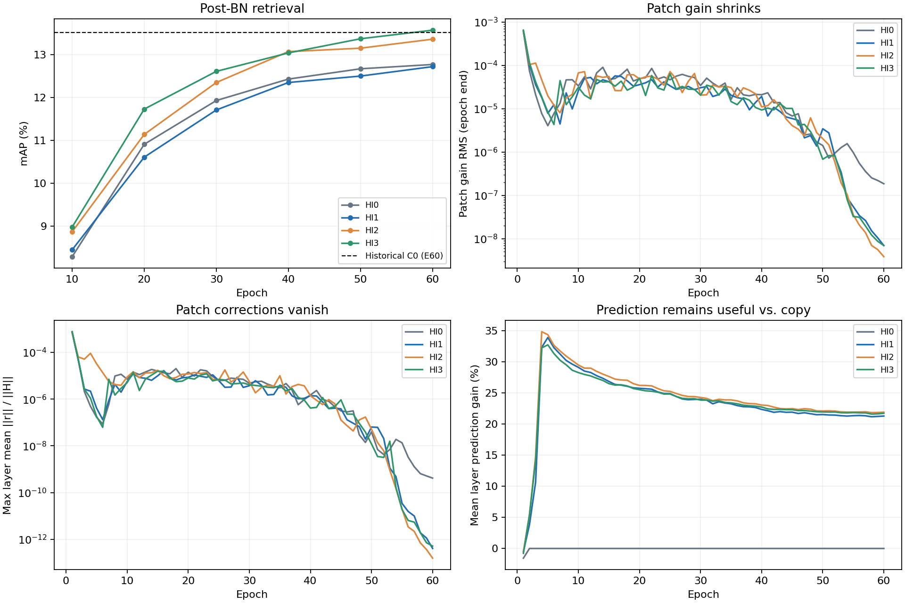
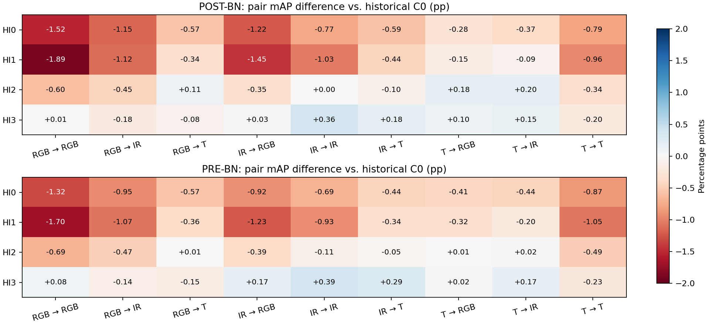

# 历史创新量适配 HI0—HI3 四组实验结果分析（2026-10-09）

## Material Passport

- 任务：分析 baseline＋历史创新量适配的四组已完成实验，判断性能、对照结论及机制是否实际生效。
- Verification Status：**ANALYZED**。已交叉核验原始日志、配置、epoch诊断和最终权重，并完成局部CPU前向开关检查；没有重新训练60epoch，也没有本地重跑完整query/gallery检索。
- 主证据：`E:/CVPR2027/ref/Trajectory_runs/history_innovation_1009/HI{0,1,2,3}_seed1234`。
- 历史参照：`trajectory_extensions_1002` 下 C0/T1/T2 的独立post/pre-BN测试日志；baseline数值采用用户此前给定历史结果，未伪称本轮重训。
- 实现基准：独立分支 `codex/history-innovation`，服务器四组记录的提交均为 `b44e69ce5a09332d6c652d47fbaa89508d661fae`。
- 分析原则：固定第60epoch，同一权重post-BN为主、pre-BN为补充；指标单位为%，增减为**百分点（pp）**；仅描述单seed结果，不报告显著性、置信区间或稳定性结论。

## 1. 核心结论

**本轮HI3最值得保留，但暂时不能据此把历史创新量适配确定为新的模块一。**

1. HI3-post达到 **13.57 / 33.49 / 49.95 / 57.72**，相对C0-post的mAP仅增加0.05pp，Rank-1/5/10分别下降0.12/0.10/0.47pp。它不是全面超过C0。
2. HI3-pre达到 **13.21 / 34.11 / 50.71 / 58.66**，相对C0-pre四项均提升，分别为0.08/0.37/0.14/0.36pp；这是有价值的观测，但仍是历史参照下的一次训练结果。
3. 本轮四项主结果的顺序均为 **HI3 > HI2 > HI0 > HI1**。完整文档设置HI1没有胜过不使用预测损失的HI0，说明“加预测监督→提升检索”的链条没有得到支持。
4. 更重要的问题是：**四组的实际修正分支在训练后期几乎全部收缩到零。** HI1/HI2/HI3的最终patch增益RMS约为10⁻⁹，Anchor与Corrector也接近零；并非仅门控统计看起来小。
5. 对最终权重做12张真实query图片的局部开关检查，HI1/HI2/HI3关闭适配器后的pre/post-BN特征逐元素完全一致；HI0仅有约10⁻⁶量级差异。因此，目前不能宣称分数来自最终检索时持续发挥作用的历史修正。早期训练影响仍可能保留在主干中。

**建议：保留C0为已确认的模块一参照，保留HI3为本轮最好结果；下一步优先定位修正分支退化，暂缓增加新组合、扩大预测损失或直接更换主方案。**

## 2. 实验对应关系与有效性核验

### 2.1 四组实际运行的方案

| 组别 | 修正token | 实际增益公式 | 预测损失λ | 与HI1相比改变的内容 |
| --- | --- | --- | --- | --- |
| HI0 | patch | 0.25·tanh(G)⊙D | 0 | 去掉预测辅助损失；仍保留预测器及历史修正结构 |
| HI1 | patch | 0.25·tanh(G)⊙D | 1 | 文档完整方案 |
| HI2 | CLS＋patch | 0.25·tanh(G)⊙D | 1 | 增加CLS自身历史与独立CLS增益；共享逐token网络 |
| HI3 | patch | 0.25·G⊙D | 1 | 去掉tanh；仍保留0.25系数 |

所有组都关闭原TOKEN_TRAJECTORY/C0；这是baseline＋新替代候选，不是C0＋模块二。全部12个block前可写入修正，低维rank64；第2—12层均有预测项，HI1—HI3从epoch1起加入。四组预测损失均只计算patch，HI2没有增加CLS预测损失。

HI0并非“无预测器”，更不是纯baseline。四组也不是token范围×增益形式的完整2×2设计，不能估计CLS与线性增益的交互作用。

### 2.2 日志、配置与权重的交叉核验

- 每组均有console、train_log、resolved_config、source_commit/status、60条history_epoch.jsonl、transformer_60.pth及两份独立测试日志。60个epoch连续完成，JSONL与train_log中的60条内联诊断完全一致。
- 独立post-BN结果与训练日志第60epoch的post-BN结果完全一致（按日志保留的两位小数）。post/pre测试均指向本组同一个transformer_60.pth，读出分别为after/before。
- 四组完整resolved_config比较：除OUTPUT_DIR外，HI0仅LOSS_WEIGHT不同、HI2仅TOKEN_SCOPE不同、HI3仅GAIN_MODE不同。没有发现某组混入C0或旧模块二开关。
- Runtime均记录Python3.8.20、torch2.4.1+cu121、torchvision0.13.1、timm1.0.19、cuDNN90100、A800-SXM4-80GB，cudnn_deterministic=True、cudnn_benchmark=True。沿用llmpar、CLIP norm、seed1234、60epoch、PKM/K4、逻辑batch64（3模态实际192图）。
- 训练500ID/92133图，query500ID/6405图，gallery500ID/93609图；三种query各2135。视角统计一致：query空1350/地5055，gallery空23343/地70266。
- source_status均只有`D README.md`，即服务器删除README，记录中没有训练源码修改。该记录是启动时快照，不能审计训练期间所有外部行为，但目前没有配置串组或代码版本混用的证据。
- 四组权重严格加载对应模型成功，全部张量有限；结构签名、CLS增益有无符合组别。固定坐标投影四组逐元素相同，正交性最大误差4.77×10⁻⁷。
- 权重中BN累计batch均为27490，与60条诊断的iterations之和一致。实际每epoch455—461步，四组逐epoch步数一致。日志进度分母469来自sampler长度估计，不能据此判定少训练或中断。
- console中的torchvision扩展、API弃用、torch.load提示没有终止训练；没有发现日志指标NaN/Inf或Traceback/OOM。AMP确实跳过了少量更新，见下表，不能说“完全没有数值溢出”。

| 组别 | 前向/反向尝试数 | AMP跳步 | 比例 | 实际优化器更新数 | 日志平均每步秒数 | 训练迭代耗时估计/min |
| --- | --- | --- | --- | --- | --- | --- |
| HI0 | 27490 | 14 | 0.051% | 27476 | 0.2665 | 122.1 |
| HI1 | 27490 | 15 | 0.055% | 27475 | 0.2680 | 122.8 |
| HI2 | 27490 | 15 | 0.055% | 27475 | 0.2746 | 125.8 |
| HI3 | 27490 | 14 | 0.051% | 27476 | 0.2683 | 122.9 |

耗时按日志每步耗时×实际步数估算，含日志计时口径内的数据/训练开销，不含完整任务所有评估和独立测试；没有正式峰值显存证据。HI2的平均每步耗时比HI1约高2.4%，不能仅凭不同任务的墙钟时间推断严格算力比例。BN在训练前向中更新，即使后续AMP跳过优化器，也会累计batch，这与27490一致。

### 2.3 核验能说明和不能说明什么

本次没有发现组别映射、checkpoint串用、读出错用或适配器未接入forward等明显实现错误。**但配置执行正确不等于优化设置合理。** 最终权重退化已经得到实证，需要单独解释；不能因为短程sanity check曾通过，就排除长程优化问题。

历史baseline/C0不是本轮同提交重新训练的匹配对照。可按既定历史协议比较，但不将HI相对历史baseline的全部差值因果归给新模块。无需为了这份结果报告重训baseline或补多seed。

## 3. 第60epoch总体结果

### 3.1 post-BN主结果

| 方案 | mAP | Rank-1 | Rank-5 | Rank-10 |
| --- | --- | --- | --- | --- |
| baseline（历史） | 12.38 | 31.02 | 47.76 | 55.80 |
| C0（历史） | 13.52 | 33.61 | 50.05 | 58.19 |
| T1（历史） | 13.42 | 33.94 | 50.18 | 58.38 |
| T2（历史） | 13.45 | 33.13 | 50.55 | 58.41 |
| HI0 | 12.77 | 32.58 | 48.65 | 56.57 |
| HI1 | 12.72 | 31.63 | 48.63 | 56.27 |
| HI2 | 13.36 | 32.69 | 49.34 | 57.39 |
| HI3 | 13.57 | 33.49 | 49.95 | 57.72 |

### 3.2 pre-BN补充结果

| 方案 | mAP | Rank-1 | Rank-5 | Rank-10 |
| --- | --- | --- | --- | --- |
| baseline（历史） | 11.99 | 31.10 | 48.57 | 56.69 |
| C0（历史） | 13.13 | 33.74 | 50.57 | 58.30 |
| T1（历史） | 12.92 | 33.11 | 51.16 | 59.00 |
| T2（历史） | 12.99 | 33.11 | 50.34 | 58.49 |
| HI0 | 12.45 | 32.82 | 49.79 | 57.44 |
| HI1 | 12.37 | 31.48 | 49.16 | 56.94 |
| HI2 | 12.89 | 32.44 | 50.05 | 58.41 |
| HI3 | 13.21 | 34.11 | 50.71 | 58.66 |

### 3.3 相对历史baseline与C0的提升值

下表均严格在相同读出间相减，正号为提升。
#### post-BN，单位pp

| 方案 | 参照 | ΔmAP | ΔRank-1 | ΔRank-5 | ΔRank-10 |
| --- | --- | --- | --- | --- | --- |
| C0 | baseline | +1.14 | +2.59 | +2.29 | +2.39 |
| HI0 | baseline | +0.39 | +1.56 | +0.89 | +0.77 |
| HI0 | C0 | -0.75 | -1.03 | -1.40 | -1.62 |
| HI1 | baseline | +0.34 | +0.61 | +0.87 | +0.47 |
| HI1 | C0 | -0.80 | -1.98 | -1.42 | -1.92 |
| HI2 | baseline | +0.98 | +1.67 | +1.58 | +1.59 |
| HI2 | C0 | -0.16 | -0.92 | -0.71 | -0.80 |
| HI3 | baseline | +1.19 | +2.47 | +2.19 | +1.92 |
| HI3 | C0 | +0.05 | -0.12 | -0.10 | -0.47 |

#### pre-BN，单位pp

| 方案 | 参照 | ΔmAP | ΔRank-1 | ΔRank-5 | ΔRank-10 |
| --- | --- | --- | --- | --- | --- |
| C0 | baseline | +1.14 | +2.64 | +2.00 | +1.61 |
| HI0 | baseline | +0.46 | +1.72 | +1.22 | +0.75 |
| HI0 | C0 | -0.68 | -0.92 | -0.78 | -0.86 |
| HI1 | baseline | +0.38 | +0.38 | +0.59 | +0.25 |
| HI1 | C0 | -0.76 | -2.26 | -1.41 | -1.36 |
| HI2 | baseline | +0.90 | +1.34 | +1.48 | +1.72 |
| HI2 | C0 | -0.24 | -1.30 | -0.52 | +0.11 |
| HI3 | baseline | +1.22 | +3.01 | +2.14 | +1.97 |
| HI3 | C0 | +0.08 | +0.37 | +0.14 | +0.36 |

所有HI组在两种读出下均高于历史baseline，但HI0/HI1距离C0明显。HI2-post相对C0四项均低；HI2-pre仅Rank-10高0.11pp。HI3是唯一在某一固定读出下四项均超过C0的组（pre-BN），不过幅度较小。

HI3-post相对历史T1的mAP高0.15pp、相对T2高0.12pp，但Rank-5/10仍低于二者；相对T1的Rank-1低0.45pp。不能将“mAP最高”写成“所有方面最好”。

### 3.4 post-BN减pre-BN

| 组别 | ΔmAP | ΔRank-1 | ΔRank-5 | ΔRank-10 |
| --- | --- | --- | --- | --- |
| HI0 | +0.32 | -0.24 | -1.14 | -0.87 |
| HI1 | +0.35 | +0.15 | -0.53 | -0.67 |
| HI2 | +0.47 | +0.25 | -0.71 | -1.02 |
| HI3 | +0.36 | -0.62 | -0.76 | -0.94 |

四组post-BN的mAP均更高，pre-BN的Rank-5/10均更高；Rank-1则有升有降。保留post主、pre辅的既定口径即可，不因HI3-pre更好看而事后切换主指标。切换测试读出本身不会改变该权重的训练过程，也无法解释本轮修正分支的收缩。

## 4. 三个单因素对照分别回答了什么
### 预测监督：HI1 − HI0

| 读出 | ΔmAP | ΔRank-1 | ΔRank-5 | ΔRank-10 |
| --- | --- | --- | --- | --- |
| post | -0.05 | -0.95 | -0.02 | -0.30 |
| pre | -0.08 | -1.34 | -0.63 | -0.50 |

**观测：** 加入预测监督后，两种读出四项指标均下降。预测损失确实加入、预测器也确实学会降低误差，因此不能解释为“λ=1没有生效”。

**边界：** 这只否定了本轮这一组配置中预测监督带来检索增益的证据，不等于所有历史预测机制都无用。预测准确率与身份判别能力不是同一个目标，且写入通道最终退化；HI0的预测器自身也收缩至近零，并非维持初始化随机预测。

### CLS写入：HI2 − HI1

| 读出 | ΔmAP | ΔRank-1 | ΔRank-5 | ΔRank-10 |
| --- | --- | --- | --- | --- |
| post | +0.64 | +1.06 | +0.71 | +1.12 |
| pre | +0.52 | +0.96 | +0.89 | +1.47 |

**观测：** 允许CLS写入后，八项读出指标都改善；早期CLS修正也确实比patch更强，说明它有机会改变训练轨迹。

**边界：** 最终CLS修正同样几乎消失，不能据此宣称最终检索依赖CLS历史。CLS/patch共享网络，新增CLS身份梯度也会影响共享网络，不能把变化仅归为“最后多了一个CLS残差”。缺少HI2无预测损失组，不能推出预测监督对CLS方案有益。

### 线性增益：HI3 − HI1

| 读出 | ΔmAP | ΔRank-1 | ΔRank-5 | ΔRank-10 |
| --- | --- | --- | --- | --- |
| post | +0.85 | +1.86 | +1.32 | +1.45 |
| pre | +0.84 | +2.63 | +1.55 | +1.72 |

**观测：** 去掉tanh后，两种读出四项指标均明显优于HI1；它是本轮最好的实际配置。

**关键限制：** 已记录增益范围远未达到tanh饱和区。HI1各epoch末patch的最大|G|仅0.01761；在此区间，tanh(G)/G偏离1最多约0.0104%，导数仍≥0.99969。HI3的最终修正也未变强。因此“tanh限制幅度导致HI1差、线性放开后修正充分发挥作用”不受本轮诊断支持。微小算子差异、早期优化分叉与AMP/数值路径均可能影响最终训练轨迹；本轮不能拆解各自贡献。

上述界限仅针对每epoch末保存的gain统计，不冒充覆盖所有iteration的极值。

## 5. 训练过程与机制诊断：分数之外的主要发现



图中修正比例使用每epoch抽样batch统计后，各层均值的最大值；并非全训练所有样本的最大值。预测收益是第2—12层的等权描述均值，不是检索mAP。

### 5.1 检索继续改善，并非60epoch结果被明显过拟合拖垮

| epoch | HI0 | HI1 | HI2 | HI3 |
| --- | --- | --- | --- | --- |
| 10 | 8.29 | 8.45 | 8.87 | 8.98 |
| 20 | 10.91 | 10.61 | 11.14 | 11.73 |
| 30 | 11.93 | 11.71 | 12.35 | 12.61 |
| 40 | 12.43 | 12.35 | 13.07 | 13.04 |
| 50 | 12.67 | 12.50 | 13.15 | 13.37 |
| 60 | 12.77 | 12.72 | 13.36 | 13.57 |

四组已记录的post-BN mAP均持续增加到60epoch，末次mAP为记录中的最高值，没有证据支持通过提前终止解决当前问题。Rank-1等个别指标峰值出现得更早（例如HI2的40epoch Rank-1为33.21），仍统一使用60epoch。不可将每个指标的不同epoch峰值拼成一行。

### 5.2 预测项有量级、有学习，但没有保住修正分支

| 组别 | CE | Triplet | 原始预测loss | 加权预测loss | 预测/(CE＋Triplet) | 层均预测收益 |
| --- | --- | --- | --- | --- | --- | --- |
| HI0 | 0.4316 | 0.6645 | 0.2619 | 0.0000 | 0.00% | 0.00% |
| HI1 | 0.4387 | 0.6661 | 0.2079 | 0.2079 | 18.82% | 21.27% |
| HI2 | 0.4331 | 0.6599 | 0.2090 | 0.2090 | 19.12% | 21.88% |
| HI3 | 0.4349 | 0.6650 | 0.2089 | 0.2089 | 19.00% | 21.71% |

预测收益定义为 `1 − mean(prediction_mse)/mean(copy_mse)`，copy表示不预测变化、直接沿用上一层状态。优先使用日志的`prediction_gain_ratio_of_means`，避免混用另一种“逐batch比值再平均”。

HI1—HI3的预测项约为CE＋Triplet的19%，不能说数值小到可忽略。但损失数值比例不等于梯度贡献比例，本轮没有记录各损失的梯度范数，不能据此判断应该扩大或缩小λ。

HI1的原始预测loss从epoch5约0.1515回升至epoch60约0.2079，仍优于copy。这是随主干变化的移动预测目标，不应把loss回升直接解释为预测器过拟合或训练崩溃。

第60epoch各预测层相对copy的收益如下（%，抽样训练batch，**不是测试集历史预测泛化评估**）：

| block前预测 | HI0 | HI1 | HI2 | HI3 |
| --- | --- | --- | --- | --- |
| 2 | 0.00 | 60.39 | 61.23 | 59.10 |
| 3 | 0.00 | 35.76 | 40.00 | 38.72 |
| 4 | 0.00 | 27.59 | 26.48 | 26.40 |
| 5 | 0.00 | 8.67 | 8.49 | 8.49 |
| 6 | 0.00 | 10.59 | 11.20 | 12.25 |
| 7 | 0.00 | 9.82 | 10.05 | 9.07 |
| 8 | 0.00 | 8.22 | 9.77 | 10.47 |
| 9 | 0.00 | 7.52 | 8.38 | 8.95 |
| 10 | 0.00 | 12.26 | 10.80 | 12.22 |
| 11 | 0.00 | 14.33 | 14.18 | 13.83 |
| 12 | 0.00 | 38.76 | 40.09 | 39.32 |

HI1—HI3的较强预测收益集中在第2层、3—4层和第12层；中间多层较低但为正。日志state_variance保持约1，但它统计的是单token通道方差，受LayerNorm与投影影响，不能据此证明跨样本表征没有坍缩。copy也只是很弱的参照，本轮没有“固定均值变化”“一阶线性预测”或打乱历史对照；不能仅凭胜过copy证明它学到了充分的样本历史条件关系。

### 5.3 增益和写入方向同时收缩

以下RMS对最终权重以float64重新计算，避免float32平方下溢掩盖极小值。

| 组别 | patch G RMS | CLS G RMS | Anchor RMS | Corrector RMS | Predictor RMS |
| --- | --- | --- | --- | --- | --- |
| HI0 | 1.855e-07 | — | 1.285e-07 | 1.889e-08 | 2.979e-26 |
| HI1 | 6.942e-09 | — | 3.776e-09 | 9.481e-11 | 9.034e-03 |
| HI2 | 3.843e-09 | 9.028e-10 | 2.435e-09 | 3.214e-10 | 9.065e-03 |
| HI3 | 6.952e-09 | — | 5.714e-09 | 1.876e-10 | 9.147e-03 |

四组patch增益中，绝对值小于10⁻²⁰的参数占比均超过99.7%；Anchor也有相同比例的极小值。HI1/HI2/HI3的Predictor仍有非零权重，但写入方向与增益均退化。HI0连Predictor整体也近零。

诊断中的“0.0”不一定代表数学上严格零：float32平方可以下溢。结论来自权重、实际残差和局部前向三方面，而不是把打印为零当成充分证据。

不同阶段实际patch修正比例：下表为`max_layer mean_batch RMS(r)/RMS(H)`。

| epoch | HI0 | HI1 | HI2 | HI3 |
| --- | --- | --- | --- | --- |
| 1 | 6.812e-04 | 7.536e-04 | 6.794e-04 | 7.655e-04 |
| 5 | 1.676e-07 | 4.102e-07 | 3.254e-05 | 1.817e-07 |
| 10 | 7.110e-06 | 5.639e-06 | 8.796e-06 | 5.054e-06 |
| 20 | 1.413e-05 | 8.576e-06 | 1.184e-05 | 7.999e-06 |
| 40 | 1.501e-06 | 1.399e-06 | 1.393e-06 | 4.144e-07 |
| 60 | 4.189e-10 | 4.124e-13 | 1.576e-13 | 5.186e-13 |

即使早期，patch修正的抽样层均比例最大也低于0.08%；到最终降至约10⁻¹⁰—10⁻¹³。HI2的CLS曾更活跃：epoch4、第1个block前的CLS层均修正比例约4.98%，epoch5约3.43%，但第60epoch各层中最大只剩2.79×10⁻¹⁶。

因此要区分“整个训练过程从未起作用”和“最终推理几乎不用它”：**前者不成立，后者有很强证据。** HI2早期CLS影响和其他组早期细小残差，都可能改变之后的主干参数。

### 5.4 最终权重开关适配器的局部核验

选择本地query目录按文件名排序每模态前4张，共12张；CLIP归一化，CPU/torch1.13.1、FP32、eval模式。先严格加载服务器最终权重，再对同一模型分别保留适配器/将`base.history_adapter=None`；主干、BN统计等不变。两种读出分别比较。此检查不计算检索指标。

| 组别 | post逐元素相同 | post最大绝对差 | pre逐元素相同 | pre最大绝对差 |
| --- | --- | --- | --- | --- |
| HI0 | False | 5.186e-06 | False | 1.431e-06 |
| HI1 | True | 0.000e+00 | True | 0.000e+00 |
| HI2 | True | 0.000e+00 | True | 0.000e+00 |
| HI3 | True | 0.000e+00 | True | 0.000e+00 |

该结果不能替代A800环境下对全部6405 query/93609 gallery的开关评估，也不能宣称所有输入都严格相等。局部12图、最终权重极小残差和全训练后期统计共同表明：继续用“最终样本历史修正改善检索”解释这些成绩，目前证据不足。

关闭适配器后的模型是**该HI训练轨迹得到的主干**，不是历史baseline权重。因此“关闭前后相同”与“HI分数高于历史baseline”完全可以同时成立，不构成矛盾。

## 6. 模态分组：是否改善了AS-ReID中的困难跨模态关系

模态映射由DATASETS.MODALITIES及loader枚举确认：1=RGB、2=IR、3=Thermal。每格为 **mAP / Rank-1**。各组固定query模态并限制gallery模态后重新评估，与全部gallery混合排名不同；九格均值不能替代总体mAP。

### 6.1 post-BN分组结果

| query → gallery | C0（历史） | HI0 | HI1 | HI2 | HI3 |
| --- | --- | --- | --- | --- | --- |
| RGB → RGB | 31.00 / 45.48 | 29.48 / 44.73 | 29.11 / 42.67 | 30.40 / 44.22 | 31.01 / 44.96 |
| RGB → IR | 19.76 / 31.80 | 18.61 / 29.65 | 18.64 / 28.43 | 19.31 / 31.15 | 19.58 / 30.26 |
| RGB → T | 6.65 / 8.81 | 6.08 / 6.79 | 6.31 / 8.67 | 6.76 / 8.43 | 6.57 / 8.15 |
| IR → RGB | 19.86 / 29.41 | 18.64 / 27.17 | 18.41 / 28.10 | 19.51 / 28.90 | 19.89 / 28.76 |
| IR → IR | 21.09 / 33.30 | 20.32 / 32.60 | 20.06 / 30.87 | 21.09 / 32.04 | 21.45 / 34.00 |
| IR → T | 6.83 / 9.37 | 6.24 / 8.62 | 6.39 / 8.57 | 6.73 / 8.90 | 7.01 / 9.27 |
| T → RGB | 6.93 / 9.04 | 6.65 / 8.67 | 6.78 / 9.41 | 7.11 / 9.70 | 7.03 / 9.56 |
| T → IR | 6.63 / 10.12 | 6.26 / 8.90 | 6.54 / 9.18 | 6.83 / 10.26 | 6.78 / 9.65 |
| T → T | 16.10 / 24.22 | 15.31 / 22.67 | 15.14 / 22.90 | 15.76 / 24.03 | 15.90 / 23.89 |

### 6.2 pre-BN分组结果

| query → gallery | C0（历史） | HI0 | HI1 | HI2 | HI3 |
| --- | --- | --- | --- | --- | --- |
| RGB → RGB | 30.30 / 46.14 | 28.98 / 44.68 | 28.60 / 43.04 | 29.61 / 44.40 | 30.38 / 46.09 |
| RGB → IR | 19.16 / 31.29 | 18.21 / 29.79 | 18.09 / 28.52 | 18.69 / 30.82 | 19.02 / 29.74 |
| RGB → T | 6.17 / 9.41 | 5.60 / 7.82 | 5.81 / 7.92 | 6.18 / 8.29 | 6.02 / 8.43 |
| IR → RGB | 19.31 / 29.04 | 18.39 / 28.48 | 18.08 / 28.29 | 18.92 / 28.15 | 19.48 / 29.84 |
| IR → IR | 20.58 / 32.93 | 19.89 / 32.46 | 19.65 / 32.04 | 20.47 / 32.93 | 20.97 / 35.36 |
| IR → T | 6.24 / 8.57 | 5.80 / 8.38 | 5.90 / 8.10 | 6.19 / 8.20 | 6.53 / 8.99 |
| T → RGB | 6.65 / 8.67 | 6.24 / 8.76 | 6.33 / 8.52 | 6.66 / 9.37 | 6.67 / 8.62 |
| T → IR | 6.39 / 9.13 | 5.95 / 8.43 | 6.19 / 8.90 | 6.41 / 9.23 | 6.56 / 9.84 |
| T → T | 15.55 / 24.26 | 14.68 / 22.86 | 14.50 / 22.15 | 15.06 / 21.83 | 15.32 / 23.51 |



- HI0、HI1在post-BN九组mAP中全部低于C0，退步并不集中在某一模态。
- HI2-post在RGB→Thermal、Thermal→RGB、Thermal→IR有小幅mAP增益（+0.11/+0.18/+0.20pp）；但RGB→RGB和RGB↔IR仍不足，整体未超过C0。
- HI3-post九组mAP有6组高于C0、3组低于C0；最大正增益来自IR→IR（+0.36pp），而RGB→IR为−0.18pp、Thermal→Thermal为−0.20pp。跨Thermal四个方向为−0.08/+0.18/+0.10/+0.15pp，呈局部改善，幅度不大。
- HI3-pre的明显局部增益也集中在IR→IR：mAP+0.39pp、Rank-1+2.43pp；RGB→Thermal和Thermal→Thermal仍下降。因此不能称为对所有模态gap的普遍解决。
- 与Thermal相关的跨模态检索仍明显弱于同模态检索。新方案没有显式模态/视角对齐目标，此结果也未显示它自动消除了这些gap。

## 7. 空地视角分组

A=空中、G=地面。A→A四组日志均为`empty or no valid query`，应记作N/A，不能记0、也不参与均值。每格仍为mAP / Rank-1。
### post-BN

| query → gallery | C0（历史） | HI0 | HI1 | HI2 | HI3 |
| --- | --- | --- | --- | --- | --- |
| A-G | 13.35 / 34.00 | 12.22 / 33.11 | 11.97 / 30.37 | 12.99 / 31.48 | 13.24 / 34.37 |
| G-A | 15.39 / 34.47 | 14.22 / 32.14 | 14.20 / 30.80 | 15.10 / 32.71 | 15.50 / 34.16 |
| G-G | 14.47 / 33.27 | 13.87 / 32.65 | 13.87 / 32.83 | 14.39 / 33.13 | 14.55 / 33.42 |

### pre-BN

| query → gallery | C0（历史） | HI0 | HI1 | HI2 | HI3 |
| --- | --- | --- | --- | --- | --- |
| A-G | 13.20 / 34.44 | 12.25 / 32.67 | 11.89 / 30.07 | 12.84 / 31.93 | 13.04 / 34.22 |
| G-A | 14.95 / 34.32 | 13.89 / 33.07 | 13.83 / 30.95 | 14.67 / 34.27 | 15.01 / 34.52 |
| G-G | 14.05 / 33.49 | 13.48 / 32.89 | 13.46 / 32.45 | 13.86 / 32.47 | 14.18 / 34.02 |

HI3-post相对C0：A→G mAP−0.11pp、Rank-1+0.37pp；G→A mAP+0.11pp、Rank-1−0.31pp；G→G mAP+0.08pp、Rank-1+0.15pp。该优势并非空地两个方向同步改善。尤其A→G Rank-5/10分别仍比C0低1.63/1.48pp，不能只展示Rank-1。

视角分组的gallery组成不同，不能用三个视角mAP简单平均重建总体mAP；也不要因为A→A无有效query便推断样本目录缺失或训练出错。

## 8. 原因判断：事实、假设与暂时不能确认的部分

### 8.1 已确认：存在长程优化退化，尚不能称为接线错误

forward确实执行`x = x + r`；HI1—HI3预测项确实加入总loss；HI2确实生成CLS修正；新参数确实走BASE_LR=3.5×10⁻⁴，而非误用主干5×10⁻⁶。early-epoch残差非零和最终权重结构均支持代码按分组执行。

**与“没接上”的错误相比，目前更突出的是已经接上的分支没有在长程训练中维持下来。** 只凭本次日志不能排除所有潜在实现问题，但应优先调查有实证的退化，而不是笼统说“新思想无效”。

### 8.2 高优先级假设：小身份梯度与耦合weight decay共同压缩乘法分支

从当前源码可直接确认：

1. 新模块的gain、Anchor、Corrector、Predictor全部沿用Adam的weight_decay=10⁻⁴，没有为gain或方向网络分开设置。
2. 修正是`0.25 × gain × direction`。gain为零初始化，初期CE/Triplet对方向网络的梯度被gain挡住；随后gain仍很小时，方向网络获得的身份梯度也被缩小。
3. 总梯度先全局clip到1，再optimizer.step；当前Adam采用耦合weight decay，衰减项在优化器内加入。这使得被裁剪后的较弱数据梯度，可能更难抵抗衰减。
4. 与C0直接调制已有的block变化量不同，本方案还要学习形成D的Anchor/Corrector。gain与D可同时变小，构成额外的退化通道。

这些机制与“gain、Anchor、Corrector一起收缩”的结果一致，因此值得优先检查。**但目前没有无衰减对照、逐项梯度范数或优化器状态，不能把weight decay宣布为唯一或已证实原因。** 也可能涉及身份目标对这条复杂支路的利用不足、逐位置密集gain的梯度稀释、0.25尺度、AMP与学习率日程的共同影响。

### 8.3 不支持的简单解释

- **“tanh饱和压死了HI1”**：已记录gain太小，tanh几乎线性；HI3也退化。
- **“预测loss太小，扩大到CE同量级就行”**：λ=1时末期已约为身份loss的19%，并确实改进预测；断点在预测结果如何转成有用写入，不是只看loss数值大小。
- **“post-BN选错导致训练不佳”**：它只是检索读出，无法导致权重收缩；两种读出的mAP排序均为HI3>HI2>HI0>HI1。pre-BN的Rank-1中HI0高于HI2，不能把mAP排序套给全部指标。
- **“延长训练就能解决”**：mAP虽仍上升，但修正分支在后期越来越弱，没有证据延长训练会使其重新激活。
- **“最终不开模块也一样，所以训练中它完全无效”**：这是把最终开关实验误当成从头训练消融。早期写入、总梯度裁剪和AMP更新路径都可能改变后来主干。

尤其需要注意：预测loss输入历史与target均detach，其直接梯度主要进入Predictor；它不会像身份loss一样直接训练主干的模态/视角不变性。即使r变小，它仍可能通过全局梯度裁剪的共同缩放、AMP溢出/跳步模式以及先前训练轨迹间接影响主干更新。因此“预测器独立学习”不等于“添加预测loss绝对不影响其他参数的优化”。

## 9. 下一步建议（不自动启动新训练）

### 9.1 当前保留决策

- 保留四组原始日志、诊断与checkpoint；HI3作为本轮最佳候选记录，HI2作为CLS早期作用的证据，HI0/HI1作为预测监督的必要负结果。
- C0继续作为模块一的既定参照。HI3的检索表现值得研究，但其“历史创新量持续修正”的核心解释尚未站稳，不宜仅凭0.05pp的post-mAP差值取代C0。
- 维持post主、pre辅；不补多seed、不重训T0，不围绕几百分之几百分点反复追逐读出/随机波动。

### 9.2 优先做机制诊断，再决定下一轮训练

**第一步：若要进一步确认最终依赖性，可只做推理，不训练。** 在原llmpar/A800环境对HI3同一权重关闭适配器跑完整post/pre评估，必要时对HI2补做。这验证完整检索是否实际依赖残差，不能替代从头无模块消融。不得直接覆盖现有eval目录，也不能用历史baseline权重替代“同一HI权重关闭模块”。本报告已完成12图局部检查，未将完整推理标成已完成。

**第二步：开展一个针对退化原因的小规模优化试验，而不是新一轮大组合。** 固定HI3结构、λ、数据与身份损失，只考察适配器weight decay的作用；主干和原baseline设置保持不变。可分为当前设置、仅gain不衰减、gain与Anchor/Corrector均不衰减；Predictor先保持原设置，以分清写入通道和预测器的影响。这里是诊断建议，不是已实现配置或已验证有效结论。

局部试验至少覆盖已观察到的epoch1—5快速收缩阶段，优先放到服务器；此前十几步smoke只能证明可反传，不能证明能活过训练初期。记录各模块参数范数、实际写入比例、CE/Triplet与预测项分开的梯度量级、裁剪前后范数，以及Adam衰减项与数据梯度的相对量级。不要只按loss是否变大选配置。

**第三步：只有当写入通道保持可测且训练正常，再做正式60epoch对照。** 如果去掉不合适的衰减仍迅速退化，再单独考察gain参数粒度或初始尺度，避免同时改token范围、预测目标、层数和学习率。待机制有效后，才重新回答“预测监督是否提升检索”“CLS是否增加收益”；不优先组合HI2＋HI3，也不直接扩大λ。

上述局部试验不是用训练集预测误差代替正式检索结果。最终仍需同时满足检索收益和机制证据；即使写入保住但性能不改善，也应据实停止或重新设计目标。

## 10. 证据范围与解释审查

本报告只对本轮单seed及已给出的历史结果做描述分析，未做统计假设检验。0.05pp不是显著性结论；没有逐query排名/AP文件，无法从汇总日志恢复可靠的逐query配对检验。60个epoch、9个模态格子也不是60次或9次独立训练重复。

按结果解释清单检查11类风险：

| 检查项 | 本报告处理 |
| --- | --- |
| 聚合反转/Simpson | 并列总体与分组；各分组gallery不同，不能按均值解释总体 |
| 生态谬误 | 不把分组mAP推断为每个人/每张图片的效果 |
| 选择偏差/Berkson | 结论限定当前WHU-MARS协议，不泛化至其他数据集 |
| Collider | 没有额外结果条件筛样/回归控制；本分析不适用因果控制论断 |
| 基率忽视 | 报告query/gallery及视角样本数，不把子集均值当总体 |
| 回归均值 | 历史优胜C0/T1/T2具有选择背景，小差值不直接称稳定超越 |
| 幸存者偏差 | 四组全部报告；AMP跳步和不利对照均保留 |
| 多处寻找效应 | 全部读出和组别列出，不只挑最高mAP/有利模态格子 |
| 分析自由度 | 固定60epoch，post主pre辅，不事后拼峰值 |
| 相关代替因果 | 检索差值、预测学习与weight-decay假设分别陈述 |
| 反向因果 | 不因分数好就反推机制有效；用真实权重与开关检查补证据 |

11/11已检查；这是解释风险核对，不代表11项统计检验通过。

## 附录A. 四组完整模态分组指标

表头T代表Thermal；数值均来自对应独立测试日志，含Rank-5、Rank-10与mINP，便于避免只看mAP/Rank-1。
### post-BN

| 组别 | query→gallery | mAP | Rank-1 | Rank-5 | Rank-10 | mINP |
| --- | --- | --- | --- | --- | --- | --- |
| HI0 | RGB → RGB | 29.48 | 44.73 | 61.26 | 69.46 | 6.32 |
| HI0 | RGB → IR | 18.61 | 29.65 | 47.35 | 55.41 | 2.83 |
| HI0 | RGB → T | 6.08 | 6.79 | 17.38 | 24.40 | 1.17 |
| HI0 | IR → RGB | 18.64 | 27.17 | 44.54 | 53.26 | 3.42 |
| HI0 | IR → IR | 20.32 | 32.60 | 49.98 | 57.75 | 2.87 |
| HI0 | IR → T | 6.24 | 8.62 | 18.88 | 25.39 | 1.19 |
| HI0 | T → RGB | 6.65 | 8.67 | 17.52 | 23.79 | 1.40 |
| HI0 | T → IR | 6.26 | 8.90 | 17.85 | 23.65 | 1.08 |
| HI0 | T → T | 15.31 | 22.67 | 38.03 | 46.32 | 2.70 |
| HI1 | RGB → RGB | 29.11 | 42.67 | 60.66 | 68.34 | 6.43 |
| HI1 | RGB → IR | 18.64 | 28.43 | 46.93 | 54.52 | 2.78 |
| HI1 | RGB → T | 6.31 | 8.67 | 18.88 | 25.34 | 1.20 |
| HI1 | IR → RGB | 18.41 | 28.10 | 45.01 | 53.35 | 3.41 |
| HI1 | IR → IR | 20.06 | 30.87 | 49.65 | 57.10 | 3.00 |
| HI1 | IR → T | 6.39 | 8.57 | 18.03 | 24.45 | 1.23 |
| HI1 | T → RGB | 6.78 | 9.41 | 18.78 | 24.26 | 1.39 |
| HI1 | T → IR | 6.54 | 9.18 | 19.25 | 25.25 | 1.07 |
| HI1 | T → T | 15.14 | 22.90 | 37.52 | 46.32 | 2.85 |
| HI2 | RGB → RGB | 30.40 | 44.22 | 62.76 | 70.82 | 6.55 |
| HI2 | RGB → IR | 19.31 | 31.15 | 47.78 | 56.07 | 2.86 |
| HI2 | RGB → T | 6.76 | 8.43 | 18.88 | 25.67 | 1.34 |
| HI2 | IR → RGB | 19.51 | 28.90 | 45.15 | 54.71 | 3.63 |
| HI2 | IR → IR | 21.09 | 32.04 | 50.21 | 58.83 | 3.17 |
| HI2 | IR → T | 6.73 | 8.90 | 19.63 | 26.23 | 1.25 |
| HI2 | T → RGB | 7.11 | 9.70 | 18.83 | 25.43 | 1.49 |
| HI2 | T → IR | 6.83 | 10.26 | 19.72 | 26.00 | 1.21 |
| HI2 | T → T | 15.76 | 24.03 | 39.72 | 47.40 | 3.07 |
| HI3 | RGB → RGB | 31.01 | 44.96 | 62.34 | 69.88 | 6.96 |
| HI3 | RGB → IR | 19.58 | 30.26 | 47.82 | 57.28 | 3.06 |
| HI3 | RGB → T | 6.57 | 8.15 | 20.33 | 26.65 | 1.27 |
| HI3 | IR → RGB | 19.89 | 28.76 | 46.70 | 54.66 | 3.80 |
| HI3 | IR → IR | 21.45 | 34.00 | 51.99 | 60.75 | 3.26 |
| HI3 | IR → T | 7.01 | 9.27 | 19.44 | 26.65 | 1.38 |
| HI3 | T → RGB | 7.03 | 9.56 | 18.55 | 26.51 | 1.54 |
| HI3 | T → IR | 6.78 | 9.65 | 20.80 | 27.35 | 1.16 |
| HI3 | T → T | 15.90 | 23.89 | 38.55 | 46.93 | 2.88 |

### pre-BN

| 组别 | query→gallery | mAP | Rank-1 | Rank-5 | Rank-10 | mINP |
| --- | --- | --- | --- | --- | --- | --- |
| HI0 | RGB → RGB | 28.98 | 44.68 | 62.76 | 69.74 | 6.00 |
| HI0 | RGB → IR | 18.21 | 29.79 | 47.96 | 56.11 | 2.59 |
| HI0 | RGB → T | 5.60 | 7.82 | 17.28 | 23.93 | 1.06 |
| HI0 | IR → RGB | 18.39 | 28.48 | 45.71 | 53.91 | 3.20 |
| HI0 | IR → IR | 19.89 | 32.46 | 50.12 | 58.88 | 2.67 |
| HI0 | IR → T | 5.80 | 8.38 | 18.50 | 25.57 | 1.06 |
| HI0 | T → RGB | 6.24 | 8.76 | 17.66 | 23.47 | 1.28 |
| HI0 | T → IR | 5.95 | 8.43 | 17.75 | 24.17 | 1.03 |
| HI0 | T → T | 14.68 | 22.86 | 38.41 | 45.67 | 2.53 |
| HI1 | RGB → RGB | 28.60 | 43.04 | 61.78 | 69.93 | 6.02 |
| HI1 | RGB → IR | 18.09 | 28.52 | 46.89 | 55.50 | 2.63 |
| HI1 | RGB → T | 5.81 | 7.92 | 19.67 | 25.67 | 1.05 |
| HI1 | IR → RGB | 18.08 | 28.29 | 44.82 | 53.96 | 3.16 |
| HI1 | IR → IR | 19.65 | 32.04 | 50.07 | 57.94 | 2.82 |
| HI1 | IR → T | 5.90 | 8.10 | 17.28 | 24.22 | 1.15 |
| HI1 | T → RGB | 6.33 | 8.52 | 18.31 | 24.82 | 1.28 |
| HI1 | T → IR | 6.19 | 8.90 | 18.78 | 25.67 | 1.01 |
| HI1 | T → T | 14.50 | 22.15 | 38.50 | 46.74 | 2.63 |
| HI2 | RGB → RGB | 29.61 | 44.40 | 63.14 | 70.91 | 6.05 |
| HI2 | RGB → IR | 18.69 | 30.82 | 48.06 | 56.77 | 2.67 |
| HI2 | RGB → T | 6.18 | 8.29 | 19.91 | 25.71 | 1.17 |
| HI2 | IR → RGB | 18.92 | 28.15 | 47.21 | 55.13 | 3.34 |
| HI2 | IR → IR | 20.47 | 32.93 | 50.30 | 59.58 | 2.90 |
| HI2 | IR → T | 6.19 | 8.20 | 19.53 | 26.56 | 1.10 |
| HI2 | T → RGB | 6.66 | 9.37 | 18.92 | 25.06 | 1.37 |
| HI2 | T → IR | 6.41 | 9.23 | 19.81 | 26.46 | 1.13 |
| HI2 | T → T | 15.06 | 21.83 | 38.74 | 46.79 | 2.78 |
| HI3 | RGB → RGB | 30.38 | 46.09 | 63.56 | 71.05 | 6.34 |
| HI3 | RGB → IR | 19.02 | 29.74 | 48.57 | 57.80 | 2.83 |
| HI3 | RGB → T | 6.02 | 8.43 | 19.39 | 26.32 | 1.15 |
| HI3 | IR → RGB | 19.48 | 29.84 | 46.60 | 55.88 | 3.53 |
| HI3 | IR → IR | 20.97 | 35.36 | 51.52 | 60.42 | 3.10 |
| HI3 | IR → T | 6.53 | 8.99 | 19.58 | 25.81 | 1.29 |
| HI3 | T → RGB | 6.67 | 8.62 | 19.25 | 26.00 | 1.44 |
| HI3 | T → IR | 6.56 | 9.84 | 20.61 | 26.93 | 1.09 |
| HI3 | T → T | 15.32 | 23.51 | 38.97 | 47.49 | 2.65 |

## 附录B. 四组完整视角分组指标
### post-BN

| 组别 | query→gallery | mAP | Rank-1 | Rank-5 | Rank-10 | mINP |
| --- | --- | --- | --- | --- | --- | --- |
| HI0 | A-G | 12.22 | 33.11 | 47.56 | 56.07 | 0.55 |
| HI0 | G-A | 14.22 | 32.14 | 47.57 | 55.43 | 1.22 |
| HI0 | G-G | 13.87 | 32.65 | 49.45 | 57.13 | 0.87 |
| HI1 | A-G | 11.97 | 30.37 | 48.15 | 56.52 | 0.57 |
| HI1 | G-A | 14.20 | 30.80 | 46.43 | 54.09 | 1.25 |
| HI1 | G-G | 13.87 | 32.83 | 48.92 | 56.18 | 0.90 |
| HI2 | A-G | 12.99 | 31.48 | 50.00 | 56.67 | 0.61 |
| HI2 | G-A | 15.10 | 32.71 | 49.74 | 57.66 | 1.27 |
| HI2 | G-G | 14.39 | 33.13 | 49.18 | 57.59 | 0.93 |
| HI3 | A-G | 13.24 | 34.37 | 49.85 | 58.22 | 0.57 |
| HI3 | G-A | 15.50 | 34.16 | 50.47 | 57.14 | 1.32 |
| HI3 | G-G | 14.55 | 33.42 | 50.00 | 57.90 | 0.96 |

### pre-BN

| 组别 | query→gallery | mAP | Rank-1 | Rank-5 | Rank-10 | mINP |
| --- | --- | --- | --- | --- | --- | --- |
| HI0 | A-G | 12.25 | 32.67 | 48.96 | 57.26 | 0.71 |
| HI0 | G-A | 13.89 | 33.07 | 49.53 | 57.87 | 1.19 |
| HI0 | G-G | 13.48 | 32.89 | 49.78 | 57.11 | 0.83 |
| HI1 | A-G | 11.89 | 30.07 | 48.59 | 56.96 | 0.71 |
| HI1 | G-A | 13.83 | 30.95 | 48.08 | 56.73 | 1.19 |
| HI1 | G-G | 13.46 | 32.45 | 49.38 | 56.73 | 0.83 |
| HI2 | A-G | 12.84 | 31.93 | 49.63 | 58.00 | 0.77 |
| HI2 | G-A | 14.67 | 34.27 | 52.43 | 59.21 | 1.20 |
| HI2 | G-G | 13.86 | 32.47 | 49.43 | 57.73 | 0.87 |
| HI3 | A-G | 13.04 | 34.22 | 49.63 | 58.15 | 0.75 |
| HI3 | G-A | 15.01 | 34.52 | 52.90 | 59.47 | 1.26 |
| HI3 | G-G | 14.18 | 34.02 | 50.51 | 58.48 | 0.89 |

## 附录C. 原始证据定位与复核方式

独立测试结果块的起始行如下；路径均为本地原始文件，未修改。

| 组别 | 读出 | 结果块文件及行号 |
| --- | --- | --- |
| C0 | post | [test_log_20261002_0206.txt](E:/CVPR2027/ref/Trajectory_runs/trajectory_extensions_1002/C0_seed1234/eval_postBN/test_log_20261002_0206.txt:254) |
| C0 | pre | [test_log_20261002_0203.txt](E:/CVPR2027/ref/Trajectory_runs/trajectory_extensions_1002/C0_seed1234/eval_preBN/test_log_20261002_0203.txt:254) |
| T1 | post | [test_log_20261001_2337.txt](E:/CVPR2027/ref/Trajectory_runs/trajectory_extensions_1002/T1_seed1234/eval_postBN/test_log_20261001_2337.txt:254) |
| T1 | pre | [test_log_20261001_2334.txt](E:/CVPR2027/ref/Trajectory_runs/trajectory_extensions_1002/T1_seed1234/eval_preBN/test_log_20261001_2334.txt:254) |
| T2 | post | [test_log_20261001_2334.txt](E:/CVPR2027/ref/Trajectory_runs/trajectory_extensions_1002/T2_seed1234/eval_postBN/test_log_20261001_2334.txt:254) |
| T2 | pre | [test_log_20261001_2331.txt](E:/CVPR2027/ref/Trajectory_runs/trajectory_extensions_1002/T2_seed1234/eval_preBN/test_log_20261001_2331.txt:254) |
| HI0 | post | [test_log_20261009_0112.txt](E:/CVPR2027/ref/Trajectory_runs/history_innovation_1009/HI0_seed1234/eval_postBN/test_log_20261009_0112.txt:271) |
| HI0 | pre | [test_log_20261009_0116.txt](E:/CVPR2027/ref/Trajectory_runs/history_innovation_1009/HI0_seed1234/eval_preBN/test_log_20261009_0116.txt:271) |
| HI1 | post | [test_log_20261008_2158.txt](E:/CVPR2027/ref/Trajectory_runs/history_innovation_1009/HI1_seed1234/eval_postBN/test_log_20261008_2158.txt:271) |
| HI1 | pre | [test_log_20261008_2201.txt](E:/CVPR2027/ref/Trajectory_runs/history_innovation_1009/HI1_seed1234/eval_preBN/test_log_20261008_2201.txt:271) |
| HI2 | post | [test_log_20261009_0024.txt](E:/CVPR2027/ref/Trajectory_runs/history_innovation_1009/HI2_seed1234/eval_postBN/test_log_20261009_0024.txt:271) |
| HI2 | pre | [test_log_20261009_0027.txt](E:/CVPR2027/ref/Trajectory_runs/history_innovation_1009/HI2_seed1234/eval_preBN/test_log_20261009_0027.txt:271) |
| HI3 | post | [test_log_20261008_2248.txt](E:/CVPR2027/ref/Trajectory_runs/history_innovation_1009/HI3_seed1234/eval_postBN/test_log_20261008_2248.txt:271) |
| HI3 | pre | [test_log_20261008_2251.txt](E:/CVPR2027/ref/Trajectory_runs/history_innovation_1009/HI3_seed1234/eval_preBN/test_log_20261008_2251.txt:271) |

训练证据：各HI目录`resolved_config.yml`、`source_commit.txt`、`source_status.txt`及`history_epoch.jsonl`。JSONL每行对应一个epoch，第60行为最终诊断；每epoch抽样10个batch，不是每步全量统计。四组完整诊断共240行，已与train_log逐条比对。

实现定位：

- `model/backbones/history_adapter.py`：预测、创新量、增益、Anchor/Corrector、detach边界及诊断。
- `model/backbones/vit_pytorch.py`：block前实际`x=x+r`写入。
- `loss/history_prediction.py`：patch预测损失与copy参照。
- `processor/processor.py`：加权损失、全局clip、AMP跳步及epoch汇总。
- `solver/make_optimizer.py`：新模块学习率与weight decay；`datasets/sampler.py`：PKM实际步数与估计长度。
- 既定方案与手册：[doc28](28.历史创新量适配方案与实验设置_1009.md)、[doc29](29.历史创新量适配单卡实验手册_1009.md)。本报告不修改它们的历史实验定义。

本次分析脚本（均不训练）：`tools/analyze_history_results.py`解析指标与诊断；`tools/audit_history_checkpoints.py`严格加载最终权重、统计范数并做局部开关检查。原始日志/权重及大体积解析中间产物不加入Git。该独立工作目录下的`work/history_results_review/parsed.json`保留解析明细，`checkpoint_audit.json`保留权重检查、12张图片路径及开关差异，均为本地忽略文件。

在项目根目录，使用已具备项目依赖的Python可复核：

```powershell
python tools/analyze_history_results.py --runs-root E:/CVPR2027/ref/Trajectory_runs --output work/history_results_review
python tools/audit_history_checkpoints.py --runs-root E:/CVPR2027/ref/Trajectory_runs --data-root E:/CFAN/datasets/WHU-MARS --output work/history_results_review
```

本次实际局部核验使用CFAN的Python3.10/torch1.13.1（CPU）及本地check-deps，不是正式llmpar环境；因此局部前向结论已明确限定范围。构建审计模型时使用PRETRAIN_CHOICE=no以免重复加载CLIP，随后严格加载完整已训练state_dict；这不代表服务器实验采用随机主干训练。

报告生成日期为2026-10-09；四组实际启动时间跨2026-10-08晚间至10-09凌晨，目录名是实验批次标识，不要求所有任务同日启动。
