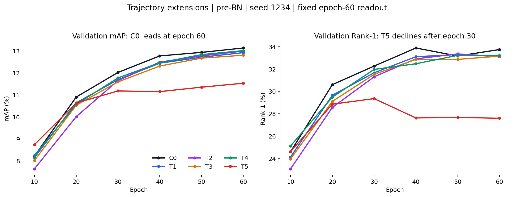

# Trajectory 扩展首轮结果分析（2026-10-02）

> 后续核对更新：用户决定本阶段沿用历史T0、只分析seed1234，不安排T0完整重训或多seed补充；新旧T0前6epoch共162条训练数值记录在打印精度下完全一致。C0/T1/T2权重现已全部补齐并读取，Trajectory张量均为有限值。下文材料缺失和重训建议属于初版分析时点，已被本更新取代。另见第8节对T4门控有效性的修正：参数非零不等于保留了有效的样本依赖。

## 1. 结论先行

**本轮首选复核对象应调整为C0（仅速度），而不是立即组合T1+T4。** C0的epoch60 pre-BN结果为 **mAP 13.13%、Rank-1 33.74%、Rank-5 50.57%、Rank-10 58.30%**，在本轮六组中mAP和Rank-1最高；相对历史T0分别为 **+0.44、+0.75个百分点**。它保留跨层动态速度驱动，说明值得优先检验的是“是否需要加速度、需要多大加速度”，而不是直接放弃Trajectory。

五个扩展候选中，T4的pre-BN mAP最高（13.01%），但只比T2高0.02、比T1高0.09个百分点，尚不足以确定稳定排序。T1的Rank-5/Rank-10最高（51.16%/59.00%），且相对历史T0四项pre-BN指标均上升，适合作为兼顾排序深度的保留候选。T5明显退化，当前rank16直接相加版本应暂停扩展。

**T0本轮尚未完成，因此所有相对T0/baseline的差值均为历史参考比较。** 六组都只有seed1234，没有运行间方差或统计显著性证据。当前结果支持调整实验优先级，不足以宣称C0必然优于T0，也不能将0.02—0.12个百分点的小差异解释为稳定优势。

## 2. 分析范围与证据核对

- 原始目录：`E:\CVPR2027\ref\Trajectory_runs\trajectory_extensions_1002`。
- 分析对象：C0、T1、T2、T3、T4、T5；每组1份训练日志、1份独立pre-BN测试日志、1份独立post-BN测试日志，共18份。
- 正式比较：固定epoch60、pre-BN为主；同一checkpoint的post-BN仅作补充。训练中其他epoch只用于解释走势，不替代最终结果。
- 历史baseline/T0采用用户在本会话给出的四组数值，没有用其他历史环境、VTC或归一化实验替换参考值。
- 分析状态：**ANALYZED**。来源为已完成实验的日志与现有checkpoint；本次没有重新训练、没有重新提取检索特征，也没有再次执行完整评测。
- 方法记录：academic-research-suite / experiment-agent，validate；2026-10-02，analysis_v1。

### 2.1 六组日志确认了什么

六组均记录连续的Epoch 1—60完成信息，每epoch为469个batch，即60×469=28,140个记录覆盖的训练batch。每组epoch60训练内验证的四项总体指标与独立pre-BN测试完全一致（以日志两位小数精度为准）。这说明两种读法没有发生可见的最终结果错位；不等同于本次重新验证了逐图像特征。

训练与测试的Runtime在18份日志中一致：Python3.8.20、torch2.4.1+cu121、torchvision0.13.1、timm1.0.19、CUDA12.1、cuDNN90100、NVIDIA A800-SXM4-80GB，benchmark=True、deterministic=True。日志记录的是SenseCore路径；解释器绝对路径没有单独写入Runtime行，因此这里确认版本指纹与约定llmpar一致，不声称日志证明了实际解释器路径或物理GPU编号。

全部运行的最终解析配置已与本地对应YAML经真实YACS合并后的设置逐字段核对。除方案选择、C0的ACCEL_MIX=0和输出目录外，本轮配置一致：CLIP ViT-B/16、256×128、CLIP mean/std、PKM逻辑batch64（三模态192图）、K=4、seed1234、Adam、主干5e-6/新增模块3.5e-4、原CE+Triplet、60epoch。VTC、VPR、modality delta等分支未启用。

每组独立pre/post测试的解析配置只改变NECK_FEAT和输出目录，TEST.WEIGHT指向同一个该组transformer_60.pth。**post-BN日志前部打印的原YAML仍可能写before，实际命令行合并后的配置为after；本报告依据后者取值，不按原YAML片段误判。**

六组query总数为6,405（每模态2,135）；视角统计一致：query航拍1,350/地面5,055，gallery航拍23,343/地面70,266，总gallery93,609。当前为PROTOCOL=ALL、METRIC=sysu、L2特征归一化、不rerank、非top-k近似。源码sysu规则排除同相机gallery。

### 2.2 当前本地材料的完整性

| 组别 | 60epoch及pre/post日志 | 本地epoch60权重 | 权重层面的可核验范围 |
| --- | --- | --- | --- |
| C0 | 齐全 | **缺少** | 仅可确认日志结果；暂不能本地补测/读取模块参数 |
| T1 | 齐全 | **缺少** | 仅可确认日志结果；暂不能本地补测/读取模块参数 |
| T2 | 齐全 | **缺少** | 仅可确认日志结果；暂不能本地补测/读取模块参数 |
| T3 | 齐全 | 有 | 已检查方法标识和Trajectory参数 |
| T4 | 齐全 | 有 | 已检查方法标识和Trajectory参数 |
| T5 | 齐全 | 有 | 已检查方法标识和Trajectory参数 |

C0/T1/T2缺少权重文件不等于训练失败：它们具有epoch60验证与后续独立测试完整日志。但最好补齐这三个checkpoint，尤其C0和T1，以支持复核与机制诊断。没有T0本轮材料，也没有本轮baseline重训。

现有日志没有捕获到NaN、Inf、Traceback等异常文本；原训练器没有记录AMP跳步总数，stdout/stderr也不一定全部进入logger文件。因此不能据此声称“零AMP跳步”或完整数值健康审计已经通过。日志亦没有Git提交号，无法仅靠日志证明远端执行的源码逐字节等于本地提交。

## 3. epoch60 pre-BN主结果

表中指标单位均为%，差值单位为百分点；历史行不是本轮新实验。

| 组别 | 方法/来源 | mAP | Rank-1 | Rank-5 | Rank-10 | ΔmAP vs历史T0 | ΔR1 vs历史T0 |
| --- | --- | --- | --- | --- | --- | --- | --- |
| baseline（历史） | 用户提供 | 11.99 | 31.10 | 48.57 | 56.69 | — | — |
| T0（历史） | 用户提供 | 12.69 | 32.99 | 50.07 | 58.66 | — | — |
| C0 | 仅速度 | 13.13 | 33.74 | 50.57 | 58.30 | +0.44 | +0.75 |
| T1 | 自适应加速度 | 12.92 | 33.11 | 51.16 | 59.00 | +0.23 | +0.12 |
| T2 | 速度/加速度双分支 | 12.99 | 33.11 | 50.34 | 58.49 | +0.30 | +0.12 |
| T3 | EMA历史外推 | 12.80 | 33.15 | 49.87 | 58.17 | +0.11 | +0.16 |
| T4 | 样本token门控 | 13.01 | 33.21 | 50.51 | 58.22 | +0.32 | +0.22 |
| T5 | 低秩通道混合 | 11.53 | 27.59 | 43.64 | 51.71 | -1.16 | -5.40 |

按pre-BN mAP排序：**C0 > T4 > T2 > T1 > T3 > T5**。按Rank-1排序：**C0 > T4 > T3 > T1=T2 > T5**。T1同时取得本轮最高Rank-5和Rank-10，不能仅凭mAP排序删除它。

C0相对历史baseline为mAP +1.14、Rank-1 +2.64个百分点；相对历史T0虽提高mAP/Rank-1/Rank-5，但Rank-10下降0.36个百分点，并非全面占优。T1相对历史T0四项变化为+0.23/+0.12/+1.09/+0.34，是本轮扩展方案中四项pre-BN均提升的一组。

### 相对历史baseline的提升（pre-BN主结果）

参照历史baseline的pre-BN结果：mAP 11.99%、Rank-1 31.10%、Rank-5 48.57%、Rank-10 56.69%。以下为“本组结果−历史baseline”，单位为**百分点**，不是相对增长率；负值表示下降。

| 组别 | ΔmAP vs历史baseline | ΔR1 vs历史baseline | ΔR5 vs历史baseline | ΔR10 vs历史baseline |
| --- | --- | --- | --- | --- |
| T0（历史） | +0.70 | +1.89 | +1.50 | +1.97 |
| C0 | +1.14 | +2.64 | +2.00 | +1.61 |
| T1 | +0.93 | +2.01 | +2.59 | +2.31 |
| T2 | +1.00 | +2.01 | +1.77 | +1.80 |
| T3 | +0.81 | +2.05 | +1.30 | +1.48 |
| T4 | +1.02 | +2.11 | +1.94 | +1.53 |
| T5 | -0.46 | -3.51 | -4.93 | -4.98 |

### 3.1 在同轮内，以C0为参照比较新增复杂度

| 组别 | Trajectory参数数 | ΔmAP vs C0 | ΔR1 vs C0 | ΔR5 vs C0 | ΔR10 vs C0 |
| --- | --- | --- | --- | --- | --- |
| T1 | 1,089,852 | -0.21 | -0.63 | +0.59 | +0.70 |
| T2 | 2,080,512 | -0.14 | -0.63 | -0.23 | +0.19 |
| T3 | 1,089,792 | -0.33 | -0.59 | -0.70 | -0.13 |
| T4 | 1,360,491 | -0.12 | -0.53 | -0.06 | -0.08 |
| T5 | 1,360,128 | -1.60 | -6.15 | -6.93 | -6.59 |

该比较是独立完整训练结果之间的比较，不是把同一checkpoint推理时关闭加速度。C0不增加参数，且在本轮主指标领先；当前没有证据表明增加动态预测、双分支或通道映射的复杂度必然带来更好的总体检索。

## 4. post-BN补充结果及读出差异

| 组别 | mAP | Rank-1 | Rank-5 | Rank-10 | ΔmAP vs历史T0 | ΔR1 vs历史T0 |
| --- | --- | --- | --- | --- | --- | --- |
| baseline（历史） | 12.38 | 31.02 | 47.76 | 55.80 | — | — |
| T0（历史） | 13.30 | 33.60 | 49.88 | 57.95 | — | — |
| C0 | 13.52 | 33.61 | 50.05 | 58.19 | +0.22 | +0.01 |
| T1 | 13.42 | 33.94 | 50.18 | 58.38 | +0.12 | +0.34 |
| T2 | 13.45 | 33.13 | 50.55 | 58.41 | +0.15 | -0.47 |
| T3 | 13.22 | 32.94 | 49.02 | 57.02 | -0.08 | -0.66 |
| T4 | 13.48 | 33.16 | 50.04 | 58.27 | +0.18 | -0.44 |
| T5 | 11.47 | 27.62 | 43.22 | 51.35 | -1.83 | -5.98 |

### 相对历史baseline的提升（post-BN补充结果）

参照历史baseline的post-BN结果：mAP 12.38%、Rank-1 31.02%、Rank-5 47.76%、Rank-10 55.80%。以下差值单位为**百分点**，仅与相同post-BN读出的历史baseline比较。

| 组别 | ΔmAP vs历史baseline | ΔR1 vs历史baseline | ΔR5 vs历史baseline | ΔR10 vs历史baseline |
| --- | --- | --- | --- | --- |
| T0（历史） | +0.92 | +2.58 | +2.12 | +2.15 |
| C0 | +1.14 | +2.59 | +2.29 | +2.39 |
| T1 | +1.04 | +2.92 | +2.42 | +2.58 |
| T2 | +1.07 | +2.11 | +2.79 | +2.61 |
| T3 | +0.84 | +1.92 | +1.26 | +1.22 |
| T4 | +1.10 | +2.14 | +2.28 | +2.47 |
| T5 | -0.91 | -3.40 | -4.54 | -4.45 |

### 同一checkpoint的post-BN与pre-BN差异

| 组别 | post−pre mAP | post−pre R1 | post−pre R5 | post−pre R10 |
| --- | --- | --- | --- | --- |
| C0 | +0.39 | -0.13 | -0.52 | -0.11 |
| T1 | +0.50 | +0.83 | -0.98 | -0.62 |
| T2 | +0.46 | +0.02 | +0.21 | -0.08 |
| T3 | +0.42 | -0.21 | -0.85 | -1.15 |
| T4 | +0.47 | -0.05 | -0.47 | +0.05 |
| T5 | -0.06 | +0.03 | -0.42 | -0.36 |

C0仍取得最高post-BN mAP（13.52%）；T1取得最高post-BN Rank-1（33.94%）。C0/T1/T2/T3/T4的post-BN mAP分别高于pre-BN 0.39/0.50/0.46/0.42/0.47个百分点，但Rank-k并不统一提高。T4的post-BN mAP虽高于历史T0，Rank-1却低0.44个百分点；T3的post-BN四项指标均低于历史T0。T5的post-BN mAP反而下降0.06个百分点，BN读出没有挽救其退化。

因此继续固定pre-BN主方案，不以本轮post-BN的较高mAP替换主表，也不从不同读出中分别挑选最好的mAP和Rank-1。

## 5. 空对地视角分组：C0的优势与任务目标一致

以下是pre-BN各query/gallery视角子集上的结果，每个单元为“mAP / Rank-1”，单位%。A为aerial，G为ground。

| 组别 | A→G | G→A | G→G |
| --- | --- | --- | --- |
| C0 | 13.20 / 34.44 | 14.95 / 34.32 | 14.05 / 33.49 |
| T1 | 12.41 / 32.44 | 14.62 / 34.94 | 14.05 / 33.47 |
| T2 | 12.59 / 32.89 | 14.69 / 35.51 | 14.07 / 33.02 |
| T3 | 12.39 / 32.15 | 14.36 / 33.23 | 13.90 / 33.89 |
| T4 | 12.59 / 34.00 | 14.62 / 34.21 | 14.09 / 33.29 |
| T5 | 11.10 / 27.11 | 12.75 / 26.66 | 12.43 / 27.46 |

- **A→G：C0为13.20/34.44，两项均为本轮最高。** 相对T4为+0.61/+0.44，相对T1为+0.79/+2.00。这使C0的优先级不仅来自总体mAP，也来自任务直接关注的航拍query→地面gallery。
- **G→A：C0的mAP最高14.95；T2的Rank-1最高35.51。** 两者各有优势，不能说C0覆盖所有视角的全部指标。
- **G→G：T4的mAP最高14.09，T3的Rank-1最高33.89。** C0为14.05/33.49，差距较小。
- 六组A→A都显示“empty or no valid query”。应记为不可评估，不是0%；仅凭这条日志不能断定是原始样本为空还是同相机排除后无有效正样本。

总体指标是在完整混合gallery上计算；视角子集改变候选集合，不能把三项mAP平均后冒充总体mAP。历史T0没有提供对应视角表，因此本节不计算相对历史T0的视角收益。

## 6. 模态分组：局部改善不能替代总体排序

模态编号按解析配置和评估顺序映射为1=RGB、2=IR、3=Thermal。以下是pre-BN子集mAP，单位%；是诊断矩阵，不是总体mAP的九项分解平均。

| Query→Gallery | C0 | T1 | T2 | T3 | T4 | T5 |
| --- | --- | --- | --- | --- | --- | --- |
| RGB→RGB | 30.30 | 30.32 | 30.20 | 29.78 | 29.75 | 25.75 |
| RGB→IR | 19.16 | 19.08 | 18.88 | 18.67 | 18.78 | 16.53 |
| RGB→Thermal | 6.17 | 6.05 | 6.27 | 6.16 | 6.47 | 6.27 |
| IR→RGB | 19.31 | 19.00 | 19.06 | 18.74 | 18.99 | 17.06 |
| IR→IR | 20.58 | 20.43 | 20.34 | 20.36 | 20.68 | 17.43 |
| IR→Thermal | 6.24 | 5.99 | 6.54 | 5.98 | 6.57 | 6.52 |
| Thermal→RGB | 6.65 | 6.43 | 6.45 | 6.61 | 6.73 | 6.92 |
| Thermal→IR | 6.39 | 6.16 | 6.31 | 6.06 | 6.50 | 6.46 |
| Thermal→Thermal | 15.55 | 14.96 | 15.02 | 14.88 | 15.32 | 13.19 |

T4在与Thermal相关的四个跨模态方向上均比C0更高：RGB→Thermal 6.47 vs6.17、IR→Thermal 6.57 vs6.24、Thermal→RGB 6.73 vs6.65、Thermal→IR 6.50 vs6.39。但它在RGB→IR、IR→RGB和部分同模态方向上不占优，最后总体mAP仍低于C0。这支持把T4保留为有特定子集收益的候选，尚不能推断门控已经识别人或抑制背景。

T5也不是所有子集指标都下降：四个与Thermal有关的跨模态mAP均略高于C0，但RGB→RGB降至25.75（C0为30.30），IR→IR降至17.43（20.58），Thermal→Thermal降至13.19（15.55），RGB↔IR也明显下降。其总体与三个可评视角的Rank-1均大幅降低。因此“局部跨模态mAP略好”不足以抵消总体检索退化；不同gallery上的趋势分化也不能直接称为辛普森悖论。

## 7. 训练走势：T5并非单纯还没有收敛

图中全部来自训练日志每10epoch的验证；没有重选最佳epoch，最终报告仍为epoch60。

| 组别 | E10 mAP | E20 | E30 | E40 | E50 | E60 | E50→E60 |
| --- | --- | --- | --- | --- | --- | --- | --- |
| C0 | 8.22 | 10.90 | 12.02 | 12.77 | 12.93 | 13.13 | +0.20 |
| T1 | 8.15 | 10.64 | 11.69 | 12.44 | 12.71 | 12.92 | +0.21 |
| T2 | 7.64 | 10.01 | 11.65 | 12.49 | 12.77 | 12.99 | +0.22 |
| T3 | 8.02 | 10.53 | 11.59 | 12.31 | 12.67 | 12.80 | +0.13 |
| T4 | 8.25 | 10.57 | 11.77 | 12.46 | 12.83 | 13.01 | +0.18 |
| T5 | 8.74 | 10.63 | 11.18 | 11.15 | 11.35 | 11.53 | +0.18 |

T5在epoch10的mAP为8.74，反而高于其余组；epoch20后优势消失，epoch30到60的Rank-1从29.35降到27.59，下降1.76个百分点，而其mAP只从11.18升到11.53。其他组最终mAP持续改善。这更像当前表达/优化方式出现了排序折衷，不能简单解释为训练启动失败，也没有依据仅靠延长epoch就能追上。

以下为epoch60最后一次打印的累计均值，打印位置为Iteration450/469，**不是完整epoch469个batch的精确均值**：

| 组别 | 总Loss | CE | Triplet | 训练Acc | 平均秒/batch（60个epoch日志） |
| --- | --- | --- | --- | --- | --- |
| C0 | 1.092 | 0.428 | 0.664 | 95.9% | 0.241 |
| T1 | 1.064 | 0.382 | 0.682 | 96.0% | 0.253 |
| T2 | 1.035 | 0.350 | 0.684 | 96.4% | 0.248 |
| T3 | 1.066 | 0.388 | 0.678 | 96.0% | 0.248 |
| T4 | 1.055 | 0.372 | 0.683 | 96.0% | 0.270 |
| T5 | 1.037 | 0.652 | 0.384 | 95.1% | 0.257 |

T5的Triplet均值0.384远低于C0的0.664，但CE为0.652，高于其他组约0.350—0.428；最终检索反而更差。可确认的是“较低训练Triplet不等于更好测试排序”。当前Triplet使用未显式L2归一化的pre-BN特征，最终检索则L2归一化；特征尺度/几何改变是待检验解释之一，但没有逐样本特征范数和分支输出统计，不能认定已经证实这一原因，更不能只凭Loss认定过拟合。

秒/batch只是不同运行的日志平均，包含数据等待与运行负载差异，没有做同步吞吐benchmark或峰值显存测试。原日志Speed按逻辑batch64计算，不是三模态实际192张图的吞吐，因此不直接拿其数值比较模块算力效率。

## 8. checkpoint检查与机制解释的边界

已对当前存在的T3/T4/T5权重以CPU只读方式检查：

| 组别 | 方法标识 | gain平均绝对值 | gain最大绝对值 | 新增零初始化输出层 |
| --- | --- | --- | --- | --- |
| T3 | [3.0, 12.0, 129.0, 768.0, 1.0, 0.25] | 0.001804 | 0.168957 | 不适用 |
| T4 | [4.0, 12.0, 129.0, 768.0, 1.0, 16.0] | 0.001788 | 0.526069 | 数值非零；其中8处输入相关权重仅约10⁻⁴¹，见下方修正 |
| T5 | [5.0, 12.0, 129.0, 768.0, 1.0, 16.0] | 0.001440 | 0.143817 | 11层均已非零 |

方法标识依次确认EMA rho0.25、token_gate hidden16、channel_mix rank16；Trajectory张量均为有限值，三个gain的非零比例均为100%。T4/T5的输出投影在数值上非零，但不能由此认定所有位置都保留有效的动态映射。

**后续权重细查修正：** T4共11个门控位置，其中零起始索引1—8的第一层权重、第一层偏置与输出权重绝对值均不超过约6.31×10⁻⁴¹；输出偏置仍非零。这8处在最终checkpoint上基本是固定倍率（约0.991—1.016），不是有效的样本/token门控。索引0、9、10仍保留非微小的输入相关权重，但其实际样本响应尚未测量。因此，T4的性能不能解释为11个位置都学到了有效样本自适应。现有Adam对门控使用1e-4权重衰减，加上gain和门控输出层均零初始化，可能影响门控早期学习；这是待检验原因，不是已经确认的因果结论。

补齐的T2权重方法标识为[2,12,129,768,1,0]，速度与加速度gain均100%非零。在10个两路共有的位置，加速度/速度gain的RMS比约0.90—1.20，两路gain的余弦相似度约0.51—0.70。可确认加速度参数没有退化为零，但这些是参数统计，不是实际分支输出大小或性能贡献。T1最终系数由权重推导的范围约为0.9926—1.0107，仍紧邻初始值1；不能据此认定已学到大范围自适应加速度选择。

但权重非零并不等于它对所有样本都产生有效校正。gain绝对值不是校正范数，T5还含加性混合分支，不应据这些数值比较各模块的实际影响强度。尚未测量：T1的beta分布、T2两分支范数、T4门控值/饱和度、T5混合残差与主干及原gain残差的比例。C0/T1/T2缺少本地权重，使这些诊断部分暂不可做。

## 9. 逐版判断与下一轮优先级

| 方案 | 本轮判断 | 建议 |
|---|---|---|
| C0 | 主指标和A→G最强，且不加参数；尚未与本轮T0配对确认 | **第一优先：保留并复核** |
| T1 | mAP小幅高于历史T0；Rank-5/10本轮最佳；仅多60参数 | 保留为第二个关键候选，补齐权重后看beta是否真的自适应 |
| T2 | 比历史T0略好，但参数接近翻倍；总体未超过C0 | 降低优先级，不立即组合更多分支 |
| T3 | pre-BN改善很小、post-BN低于历史T0，弱于C0 | 暂停rho=0.25版本的扩展 |
| T4 | 五版扩展中mAP最高，Thermal相关跨模态mAP有局部收益；未超过C0 | 保留；复核后再决定是否加入更简单的速度方案 |
| T5 | 相比历史baseline/T0及同轮C0均明显退化 | 暂停当前rank16直接相加版；先查分支尺度/表示几何，暂不增加容量 |

### 推荐顺序

1. **完成T0的同设置60epoch训练与pre/post补测，并补齐C0/T1/T2权重。** 这是关闭本轮对照缺口的首要步骤；不需要重开环境、norm对比。
2. **复核T0与C0，再视预算加入T1/T4配对seed。** 保持同一读出、相同硬件条件、相同种子集合；结果仍按epoch60报告。若C0小幅优势不能重复，应保留T0暂时最好实现。
3. 若C0优势得到确认，先做更集中的加速度系数检验：原dense实现的ACCEL_MIX=0.25或0.5，比较0、弱加速度、1。这里的0.5是原方向公式的加速度系数，不是T3的EMA衰减系数；二者不能混淆。当前证据更支持“检验减弱加速度”这一方向，而非加更多模块。
4. 若还需要一个结构候选，可在C0上尝试**velocity-only的样本强度门控**：方向用LN(v)，门控也只读LN(v)，不再通过门控输入重新引入a。必须作为新方案实现和独立训练；现有T4固定使用v+a，直接把其ACCEL_MIX改0会被隔离检查拒绝，不能这样冒充该组合。
5. T5仅在诊断后考虑受控的小残差或分支学习率实验，不承诺这些修改能修复。首轮不建议直接运行T1+T4大组合，因为二者本轮都没有超过C0，组合收益没有证据。

以上是依据本轮观察重新排序的探索建议，不是确定的增益预测。保留T0源实现，C0作为优先挑战者，不立即删除或替换参考方案。

## 10. 统计与解释检查

共检查11/11类统计/方法解释风险。本轮没有p值、置信区间或多seed标准差，不做显著性检验，也不把query数量当作独立训练重复次数。

| 检查项 | 本次处理 |
|---|---|
| 1. 辛普森悖论 | 总体与模态子集趋势不同，但候选gallery不同，不作同一加权总体分解或悖论断言 |
| 2. 生态谬误 | 不从汇总mAP推断每个身份/样本获益 |
| 3. Berkson选择偏差 | 只覆盖本次提供的固定数据与实验，不外推其他数据集；未发现可检验的该类选择结构 |
| 4. 碰撞变量偏差 | 未进行条件回归/因果调整，本轮不适用 |
| 5. 基率忽略 | 保留query/gallery组成；不将不同gallery上的mAP直接拼接平均 |
| 6. 均值回归 | 最优单seed可能在复测回落，需要配对seed确认 |
| 7. 幸存者偏差 | 六组均列入，T5退化不隐藏；T0未完成明确列为缺口 |
| 8. 多重比较 | 六组×多指标属于探索筛选，不把最优者当作已证实优越 |
| 9. 分析路径选择 | 固定pre-BN与epoch60，不事后改用best epoch/post-BN作主表 |
| 10. 相关与因果 | 历史参考对比、单seed与缺少激活诊断限制机制归因 |
| 11. 反向因果 | 模块在训练前设定，无典型横断面反向因果问题；学习后参数与性能关系仍不作因果解释 |

## 11. 原始证据索引

以下链接指向本地原始日志的具体行；结果表来自独立epoch60测试。训练末次验证与对应pre-BN的四项数值已自动交叉核对。

| 组别 | 训练配置 | epoch60训练验证 | 独立pre-BN总体结果 | 独立post-BN总体结果 |
| --- | --- | --- | --- | --- |
| C0 | [解析配置](E:/CVPR2027/ref/Trajectory_runs/trajectory_extensions_1002/C0_seed1234/train_log_20261001_2359.txt:6) | [E60](E:/CVPR2027/ref/Trajectory_runs/trajectory_extensions_1002/C0_seed1234/train_log_20261001_2359.txt:1983) | [pre-BN](E:/CVPR2027/ref/Trajectory_runs/trajectory_extensions_1002/C0_seed1234/eval_preBN/test_log_20261002_0203.txt:255) | [post-BN](E:/CVPR2027/ref/Trajectory_runs/trajectory_extensions_1002/C0_seed1234/eval_postBN/test_log_20261002_0206.txt:255) |
| T1 | [解析配置](E:/CVPR2027/ref/Trajectory_runs/trajectory_extensions_1002/T1_seed1234/train_log_20261001_2123.txt:6) | [E60](E:/CVPR2027/ref/Trajectory_runs/trajectory_extensions_1002/T1_seed1234/train_log_20261001_2123.txt:1983) | [pre-BN](E:/CVPR2027/ref/Trajectory_runs/trajectory_extensions_1002/T1_seed1234/eval_preBN/test_log_20261001_2334.txt:255) | [post-BN](E:/CVPR2027/ref/Trajectory_runs/trajectory_extensions_1002/T1_seed1234/eval_postBN/test_log_20261001_2337.txt:255) |
| T2 | [解析配置](E:/CVPR2027/ref/Trajectory_runs/trajectory_extensions_1002/T2_seed1234/train_log_20261001_2123.txt:6) | [E60](E:/CVPR2027/ref/Trajectory_runs/trajectory_extensions_1002/T2_seed1234/train_log_20261001_2123.txt:1983) | [pre-BN](E:/CVPR2027/ref/Trajectory_runs/trajectory_extensions_1002/T2_seed1234/eval_preBN/test_log_20261001_2331.txt:255) | [post-BN](E:/CVPR2027/ref/Trajectory_runs/trajectory_extensions_1002/T2_seed1234/eval_postBN/test_log_20261001_2334.txt:255) |
| T3 | [解析配置](E:/CVPR2027/ref/Trajectory_runs/trajectory_extensions_1002/T3_seed1234/train_log_20261001_2337.txt:6) | [E60](E:/CVPR2027/ref/Trajectory_runs/trajectory_extensions_1002/T3_seed1234/train_log_20261001_2337.txt:1983) | [pre-BN](E:/CVPR2027/ref/Trajectory_runs/trajectory_extensions_1002/T3_seed1234/eval_preBN/test_log_20261002_0145.txt:256) | [post-BN](E:/CVPR2027/ref/Trajectory_runs/trajectory_extensions_1002/T3_seed1234/eval_postBN/test_log_20261002_0148.txt:256) |
| T4 | [解析配置](E:/CVPR2027/ref/Trajectory_runs/trajectory_extensions_1002/T4_seed1234/train_log_20261001_2135.txt:6) | [E60](E:/CVPR2027/ref/Trajectory_runs/trajectory_extensions_1002/T4_seed1234/train_log_20261001_2135.txt:1983) | [pre-BN](E:/CVPR2027/ref/Trajectory_runs/trajectory_extensions_1002/T4_seed1234/eval_preBN/test_log_20261001_2353.txt:256) | [post-BN](E:/CVPR2027/ref/Trajectory_runs/trajectory_extensions_1002/T4_seed1234/eval_postBN/test_log_20261001_2356.txt:256) |
| T5 | [解析配置](E:/CVPR2027/ref/Trajectory_runs/trajectory_extensions_1002/T5_seed1234/train_log_20261001_2340.txt:6) | [E60](E:/CVPR2027/ref/Trajectory_runs/trajectory_extensions_1002/T5_seed1234/train_log_20261001_2340.txt:1983) | [pre-BN](E:/CVPR2027/ref/Trajectory_runs/trajectory_extensions_1002/T5_seed1234/eval_preBN/test_log_20261002_0152.txt:256) | [post-BN](E:/CVPR2027/ref/Trajectory_runs/trajectory_extensions_1002/T5_seed1234/eval_postBN/test_log_20261002_0155.txt:256) |

评测定义核对：[总体/子集评测实现](../utils/metrics.py)、[训练器日志与AMP更新](../processor/processor.py)、[Triplet实现](../loss/triplet_loss.py)、[五版模块实现](../model/backbones/token_trajectory_variants.py)。解析和临时统计保存在忽略的work目录；原始日志、checkpoint和数据没有改写。本次没有启动后续实验或发布结果。
