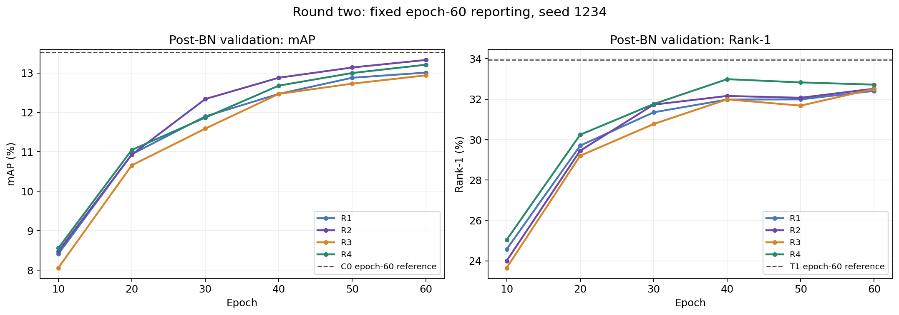

# Trajectory 第二轮结果分析（2026-10-02）

## 1. 主要结论

**R1—R4均完成训练，但本轮没有产生优于第一轮C0/T1/T2/T4的总体候选。** 在固定post-BN主读出下，这四个第一轮候选各自的mAP、Rank-1、Rank-5、Rank-10都高于本轮四组中的任意一组。因此，不应把R2“本轮mAP第一”写成整个探索阶段的最优方案，也不应立即组合R2+R3/R4。

- **R1固定β=0.5：** post-BN为13.01/32.41/48.88/57.56，低于C0与历史T0。当前结果不支持“将加速度减半就能得到更好折中”。
- **R2自适应β初值0.5：** 本轮mAP最高13.33，但Rank-1为32.52；低于原T1四项结果。最终β范围约**0.9932—1.0119**，已回到接近1，不能把它解释为训练结束后仍在使用弱加速度。
- **R3原T4门控无衰减：** 八处近零输入映射现象不再出现，但post-BN mAP由T4的13.48降至12.94，Rank-1由33.16降至32.51。**门控权重不再近零，不等于检索性能提升。**
- **R4纯速度门控：** 本轮Rank-1/Rank-10最高32.72/57.60，但四项均低于C0，当前门控未改善速度基线。

本阶段继续保留**C0（post-BN mAP最高13.52）与T1（Rank-1最高33.94）**作为两条主要候选；T2/T4保留原实现。本轮R组作为已完成的探索结果保存，不替换原方案。按用户决定沿用历史T0、只分析seed1234，不安排T0重训或多seed；以下均为该范围内的观察，不作稳定优越性或显著性声明。

## 2. 材料与实验一致性

### 2.1 已核对的材料

- 目录：`E:/CVPR2027/ref/Trajectory_runs/trajectory_refinements_1002`。
- 四组各有训练日志、独立post/pre日志和`transformer_60.pth`，共12份日志、4个权重；四个权重均已CPU只读检查。
- 每组连续记录Epoch 1—60完成，每epoch469个batch，共28,140个日志覆盖的训练batch。未记录AMP跳步总数，不能把该数当作已确认的有效优化器更新次数。
- 每组训练中epoch60的四项总体指标与独立**post-BN**测试完全一致（两位小数打印精度）；本轮训练验证采用after，不能拿它去要求pre-BN数值相同。
- pre/post的最终解析配置分别为before/after，两次TEST.WEIGHT指向同组同一个epoch60路径。采用日志`Running with config`后的最终配置，不依据原YAML片段猜测读出。
- 第一轮C0/T1—T5的独立测试日志本次重新读取，指标、视角与模态分项与首轮分析一致；历史baseline/T0仍采用用户给定数值，未用其他环境实验替换。

### 2.2 配置、运行环境与可确认边界

四份训练日志的最终解析配置已与本地YACS合并对应R组YAML及实际服务器路径覆盖后逐字段对齐。日志打印将tuple/string等转成文本，核对使用一致的打印表示；没有把yes/off等文本经YAML解析后的布尔值误认为实际运行参数类型。

固定：CLIP ViT-B/16、256×128、CLIP norm、PKM逻辑batch64（三模态192图）、K=4、Adam、主干5e-6/新增模块3.5e-4、原CE+Triplet、60epoch、seed1234；VTC、VPR、modality delta关闭。数据协议ALL，METRIC=sysu，测试L2归一化、不rerank、TOP_K_EVAL=0；sysu评测排除同相机gallery。

12份Runtime均为Python3.8.20、torch2.4.1+cu121、torchvision0.13.1、timm1.0.19、CUDA12.1、cuDNN90100、A800-SXM4-80GB、benchmark=True、deterministic=True，与第一轮记录一致。这确认版本记录一致，解释器绝对路径和物理GPU编号未单独记录。

四份checkpoint标识分别为R1/R2/R3/R4，Trajectory张量均为有限值。没有发现日志NaN/Inf/Traceback等异常文本；这不等于检查了全部stdout/stderr或零AMP跳步。权重文件保存模型状态，不含优化器状态，因此“R3/R4仅门控无衰减”由方案、已审查的本地优化器代码和方法标识共同支持，不能直接从checkpoint读出服务器实际optimizer分组。日志未记录Git提交号，不能仅凭日志证明远端源码逐字节等于本地提交。

分析状态：**ANALYZED**。本次读取日志与权重，没有重新训练、没有重新运行完整检索评测，也没有在真实图像上采集门控或β激活分布。工作流沿用academic-research-suite的结果解释规则，统计/方法风险检查覆盖11/11，见第10节。

## 3. post-BN主结果与相对历史baseline增益

所有指标单位为%；固定epoch60，不使用最佳epoch。历史行并非本轮新训练。

| 组别 | 方法/来源 | mAP | Rank-1 | Rank-5 | Rank-10 |
| --- | --- | --- | --- | --- | --- |
| baseline（历史） | 用户提供的历史参考 | 12.38 | 31.02 | 47.76 | 55.80 |
| T0（历史） | 用户提供的历史参考 | 13.30 | 33.60 | 49.88 | 57.95 |
| C0 | 仅速度 | 13.52 | 33.61 | 50.05 | 58.19 |
| T1 | β初值1的自适应加速度 | 13.42 | 33.94 | 50.18 | 58.38 |
| T2 | 速度/加速度双分支 | 13.45 | 33.13 | 50.55 | 58.41 |
| T3 | EMA历史外推 | 13.22 | 32.94 | 49.02 | 57.02 |
| T4 | 原token门控 | 13.48 | 33.16 | 50.04 | 58.27 |
| T5 | 低秩通道混合 | 11.47 | 27.62 | 43.22 | 51.35 |
| R1 | 固定β=0.5 | 13.01 | 32.41 | 48.88 | 57.56 |
| R2 | 自适应β初值0.5 | 13.33 | 32.52 | 48.81 | 57.03 |
| R3 | T4门控无衰减 | 12.94 | 32.51 | 49.59 | 57.36 |
| R4 | 纯速度门控，无衰减 | 13.21 | 32.72 | 49.56 | 57.60 |

相对历史baseline-post（12.38/31.02/47.76/55.80）的提升如下，单位为**百分点**，不是相对增长率：

| 组别 | ΔmAP | ΔRank-1 | ΔRank-5 | ΔRank-10 |
| --- | --- | --- | --- | --- |
| T0（历史） | +0.92 | +2.58 | +2.12 | +2.15 |
| C0 | +1.14 | +2.59 | +2.29 | +2.39 |
| T1 | +1.04 | +2.92 | +2.42 | +2.58 |
| T2 | +1.07 | +2.11 | +2.79 | +2.61 |
| T3 | +0.84 | +1.92 | +1.26 | +1.22 |
| T4 | +1.10 | +2.14 | +2.28 | +2.47 |
| T5 | -0.91 | -3.40 | -4.54 | -4.45 |
| R1 | +0.63 | +1.39 | +1.12 | +1.76 |
| R2 | +0.95 | +1.50 | +1.05 | +1.23 |
| R3 | +0.56 | +1.49 | +1.83 | +1.56 |
| R4 | +0.83 | +1.70 | +1.80 | +1.80 |

R1—R4仍然全部高于历史baseline-post，但这说明它们保留了相对纯baseline的收益，**不能说明新增改动优于原Trajectory候选**。评价本轮改动应重点看下一节的直接对照。

相对历史T0-post，只有R2的mAP略高0.03个百分点，但Rank-1/5/10分别低1.08/1.07/0.92个百分点；其余三组四项均低于历史T0。因此，R2也没有形成对历史T0的全面提升。

本轮mAP排序为R2 > R4 > R1 > R3；Rank-1为R4 > R2 > R3 > R1；Rank-5为R3 > R4 > R1 > R2；Rank-10为R4 > R1 > R3 > R2。最高Rank-5的R3与R4仅差0.03个百分点。不要把四项名次平均成没有预设意义的“综合第一”。

## 4. 本轮改动的直接对照

下表统一post-BN，单位为百分点；前者减后者。

| 比较（前者−后者） | ΔmAP | ΔRank-1 | ΔRank-5 | ΔRank-10 |
| --- | --- | --- | --- | --- |
| R1 − C0 | -0.51 | -1.20 | -1.17 | -0.63 |
| R1 − T0（历史） | -0.29 | -1.19 | -1.00 | -0.39 |
| R2 − R1 | +0.32 | +0.11 | -0.07 | -0.53 |
| R2 − T1 | -0.09 | -1.42 | -1.37 | -1.35 |
| R3 − T4 | -0.54 | -0.65 | -0.45 | -0.91 |
| R4 − C0 | -0.31 | -0.89 | -0.49 | -0.59 |

### 4.1 R1：固定弱加速度没有形成预期折中

固定β=0、0.5、1的mAP依次为C0 **13.52**、R1 **13.01**、历史T0 **13.30**。本轮观察不是“加速度越小越好”的单调关系，β=0.5反而低于两个端点。它不支持继续把0.25/0.75的密集系数扫描作为首要方向；也不能仅凭三个点宣布所有非零加速度都无效。

三者校正方向分别为LN(v)、LN(v+0.5a)、LN(v+a)，是各自完整训练的结果。归一化与学习后的G共同决定校正，不是对同一checkpoint做线性插值，因此性能不必随β平滑或单调变化。

### 4.2 R2：优于R1的mAP，不代表优于原T1

R2相对R1的mAP/Rank-1提高0.32/0.11，但Rank-5/10下降0.07/0.53；不是全面提升。相对原T1四项均下降，尤其Rank-1下降1.42、Rank-5下降1.37、Rank-10下降1.35个百分点。

最终β已经回到约1，所以R2与R1的差异包含整段训练中方向系数变化，不能将其全部归因为“更准确的样本自适应”。第7节进一步说明权重衰减对β的结构性偏置。

### 4.3 R3：取消门控衰减解决了近零权重现象，却没有提高性能

R3与T4使用同一计算公式和初始化方式，仅门控参数权重衰减从1e-4改0；主干和Trajectory gain等仍保持原衰减。R3的post/pre四项都低于T4。现有证据不支持把“门控映射必须保持非零”当作提升目标，亦不支持认定原T4存在需要直接修复的性能故障。

更合理的解释候选是：原衰减对门控施加的约束可能有助于最终泛化；而取消约束后的门控改变了校正分配。但没有训练集/验证集间的特征诊断和真实门控统计，不能把下降直接认定为过拟合、门控饱和或背景干扰。

### 4.4 R4：加入纯速度门控未改善C0

R4相对C0的post-BN四项下降0.31/0.89/0.49/0.59个百分点；pre-BN也四项下降。因此，不能归因于“只是不适合post-BN读出”。本轮证据不支持把该门控继续接到T1或T2上。

R4与R3相比，mAP/Rank-1/Rank-10更高、Rank-5低0.03，但两者同时改变方向与门控输入，不能作为只删除加速度的单因素因果证据。

## 5. pre-BN补充结果与读出变化

| 组别 | 方法/来源 | mAP | Rank-1 | Rank-5 | Rank-10 |
| --- | --- | --- | --- | --- | --- |
| baseline（历史） | 用户提供的历史参考 | 11.99 | 31.10 | 48.57 | 56.69 |
| T0（历史） | 用户提供的历史参考 | 12.69 | 32.99 | 50.07 | 58.66 |
| C0 | 仅速度 | 13.13 | 33.74 | 50.57 | 58.30 |
| T1 | β初值1的自适应加速度 | 12.92 | 33.11 | 51.16 | 59.00 |
| T2 | 速度/加速度双分支 | 12.99 | 33.11 | 50.34 | 58.49 |
| T3 | EMA历史外推 | 12.80 | 33.15 | 49.87 | 58.17 |
| T4 | 原token门控 | 13.01 | 33.21 | 50.51 | 58.22 |
| T5 | 低秩通道混合 | 11.53 | 27.59 | 43.64 | 51.71 |
| R1 | 固定β=0.5 | 12.55 | 32.66 | 49.34 | 57.56 |
| R2 | 自适应β初值0.5 | 12.86 | 32.76 | 48.96 | 57.52 |
| R3 | T4门控无衰减 | 12.42 | 32.96 | 49.18 | 57.66 |
| R4 | 纯速度门控，无衰减 | 12.76 | 33.33 | 50.40 | 57.97 |

相对历史baseline-pre（11.99/31.10/48.57/56.69）的提升，单位为百分点：

| 组别 | ΔmAP | ΔRank-1 | ΔRank-5 | ΔRank-10 |
| --- | --- | --- | --- | --- |
| T0（历史） | +0.70 | +1.89 | +1.50 | +1.97 |
| C0 | +1.14 | +2.64 | +2.00 | +1.61 |
| T1 | +0.93 | +2.01 | +2.59 | +2.31 |
| T2 | +1.00 | +2.01 | +1.77 | +1.80 |
| T3 | +0.81 | +2.05 | +1.30 | +1.48 |
| T4 | +1.02 | +2.11 | +1.94 | +1.53 |
| T5 | -0.46 | -3.51 | -4.93 | -4.98 |
| R1 | +0.56 | +1.56 | +0.77 | +0.87 |
| R2 | +0.87 | +1.66 | +0.39 | +0.83 |
| R3 | +0.43 | +1.86 | +0.61 | +0.97 |
| R4 | +0.77 | +2.23 | +1.83 | +1.28 |

四组同一checkpoint的post−pre差值如下：

| 组别 | post−pre mAP | post−pre Rank-1 | post−pre Rank-5 | post−pre Rank-10 |
| --- | --- | --- | --- | --- |
| R1 | +0.46 | -0.25 | -0.46 | +0.00 |
| R2 | +0.47 | -0.24 | -0.15 | -0.49 |
| R3 | +0.52 | -0.45 | +0.41 | -0.30 |
| R4 | +0.45 | -0.61 | -0.84 | -0.37 |

post-BN四组mAP全部提高0.45—0.52，但四组Rank-1均下降。本轮说明post-BN的优势仍主要体现在mAP，不能称为所有指标更优。继续遵守本轮已确定的post-BN主读出，不因R4-pre的Rank-1较高而临时切回pre或拼接指标。

尤其R3、R4在两种读出下都未超过各自T4、C0对照，本轮门控路线的负结果不依赖于单一读出的选择。

## 6. 视角与模态分项

### 6.1 post-BN视角子集

每格为mAP / Rank-1，单位%。A为aerial，G为ground。

| 组别 | A→G mAP / R1 | G→A mAP / R1 | G→G mAP / R1 |
| --- | --- | --- | --- |
| C0 | 13.35 / 34.00 | 15.39 / 34.47 | 14.47 / 33.27 |
| T1 | 12.64 / 33.78 | 15.06 / 34.27 | 14.64 / 34.26 |
| T2 | 12.79 / 32.81 | 15.26 / 33.64 | 14.59 / 33.33 |
| T4 | 12.77 / 33.41 | 15.08 / 33.49 | 14.67 / 33.18 |
| R1 | 12.47 / 32.37 | 15.04 / 32.61 | 14.09 / 32.52 |
| R2 | 12.66 / 33.48 | 14.91 / 33.23 | 14.47 / 32.76 |
| R3 | 12.54 / 33.04 | 14.72 / 31.78 | 13.95 / 32.74 |
| R4 | 12.56 / 32.52 | 15.04 / 33.02 | 14.41 / 33.58 |

航拍query→地面gallery的A→G：本轮最佳R2为12.66/33.48，仍低于C0的13.35/34.00。R4为12.56/32.52，也未在任务最直接关注的方向超过C0。R3相对T4三个可评视角的mAP和Rank-1都下降；R2相对T1的A→G mAP略高0.02，但Rank-1低0.30，不能据此声称该方向整体改善。

R4的G→G Rank-1为33.58，比C0的33.27高0.31，但G→G mAP仍低0.06，其余跨视角指标更差，不能用局部命中改善替代总体结论。

四组均记录query 6,405（每模态2,135），其中航拍1,350/地面5,055；gallery航拍23,343/地面70,266，总93,609。A→A显示empty or no valid query，记为不可评，不记0。子集评测改变gallery候选集合，不能将三项mAP平均或按query数简单加权后当作总体mAP。

### 6.2 post-BN模态子集mAP

模态1/2/3对应RGB/IR/Thermal。下表各列均为mAP，单位%；是不同候选gallery上的诊断结果。

| Query→Gallery | C0 | T1 | T4 | R1 | R2 | R3 | R4 |
| --- | --- | --- | --- | --- | --- | --- | --- |
| RGB→RGB | 31.00 | 31.04 | 30.65 | 29.74 | 30.94 | 30.14 | 30.43 |
| RGB→IR | 19.76 | 19.72 | 19.43 | 19.02 | 19.67 | 18.86 | 19.29 |
| RGB→Thermal | 6.65 | 6.48 | 6.89 | 6.50 | 6.61 | 6.35 | 6.60 |
| IR→RGB | 19.86 | 19.81 | 19.63 | 19.09 | 19.56 | 18.95 | 19.48 |
| IR→IR | 21.09 | 20.95 | 21.24 | 20.58 | 20.63 | 20.22 | 20.88 |
| IR→Thermal | 6.83 | 6.63 | 7.13 | 6.52 | 6.73 | 6.40 | 6.68 |
| Thermal→RGB | 6.93 | 6.90 | 7.27 | 6.85 | 6.95 | 6.70 | 6.92 |
| Thermal→IR | 6.63 | 6.58 | 6.94 | 6.60 | 6.58 | 6.33 | 6.52 |
| Thermal→Thermal | 16.10 | 15.67 | 15.81 | 15.70 | 15.60 | 15.40 | 15.54 |

R3相对T4九个模态方向的mAP全部下降，包括四个Thermal相关跨模态方向，因此原T4的局部跨模态优势没有因取消衰减而扩大。

R4相对C0九个模态方向的mAP全部下降，未发现能够抵消总体下降的模态mAP收益。部分子集Rank-1可以上升，例如Thermal→RGB为9.60 vs 9.04，但不足以改变总体判断。

R2相对T1在RGB→Thermal、IR→Thermal、Thermal→RGB的mAP略高，但其总体Rank-1和多项其他子集下降。局部mAP改善不能解释为整体身份排序已改善，也不能由聚合指标推断每个身份都受益。

## 7. checkpoint揭示了什么

### 7.1 标识与增益参数

| 组别 | checkpoint方法标识 | gain平均绝对值 | gain最大绝对值 |
| --- | --- | --- | --- |
| R1 | [6.0, 12.0, 129.0, 768.0, 0.5, 0.0] | 0.001799 | 0.156617 |
| R2 | [7.0, 12.0, 129.0, 768.0, 1.0, 0.5] | 0.001778 | 0.137512 |
| R3 | [8.0, 12.0, 129.0, 768.0, 1.0, 16.0] | 0.002040 | 0.163413 |
| R4 | [9.0, 12.0, 129.0, 768.0, 0.0, 16.0] | 0.002104 | 0.160787 |

四组方法标识与预期配置匹配，Trajectory参数均有限。gain绝对值不是实际校正范数，不能据均值大小判断哪组干预更强。

### 7.2 R2：初始β=0.5，最终几乎回到β=1

原T1的最终β界为0.9926—1.0107；R2为**0.9932—1.0119**。这些界由最终beta_coeff和cos、tanh(log RMS比)∈[−1,1]推导，覆盖各位置与CLS/patch；实际样本范围可能更窄，浮点取整亦会有微小差别。它不是本次在真实图像上测得的β直方图。

R2初始bias为−ln(3)≈−1.0986，最终所有bias均回到接近0（约−0.0110—0.0129），两个条件系数也很小（最大绝对值约0.01052）。因此本轮实际检验的是“从弱加速度起步、最终接近原方向”的训练路径，而不是固定弱加速度或持续明显样本自适应。

现有Adam给beta_coeff施加1e-4衰减，参数收缩目标是0，而β=2·sigmoid(0)=1。这个参数化使“衰减到零”对应“回到原加速度系数1”，**不是关闭加速度，也不是保持初始β=0.5**。权重与代码支持存在该结构性偏置；没有逐步梯度/β日志，不能进一步量化最终变化中任务梯度和衰减各占多少，也不能说R2主动发现β=1最优。

方法标识末位0.5是初始化设定，不是最终学到的β。相同地，配置ACCEL_MIX=1对R2也不能作为最终自适应强度的测量。

### 7.3 R3/R4：近零门控权重问题不再出现，但性能更差

| 组别 | 输入相关权重接近零的位置数 / 11 | 各位置输出权重绝对值最大值范围 | 输出偏置范围 |
| --- | --- | --- | --- |
| T4 | 8 | 4.964e-41 — 2.079e-01 | -0.0370 — 0.0647 |
| R3 | 0 | 1.277e-01 — 1.088e+00 | -1.0897 — 0.0494 |
| R4 | 0 | 1.160e-01 — 4.028e-01 | -0.0385 — 0.0926 |

“接近零”仅用于描述本次参数现象，表中按第一层和输出层权重绝对值最大值同时小于1e-30计数。T4八处约10⁻⁴¹，R3/R4均没有该现象，且各输出投影已明显离开零初始化。R3第一处输出偏置约−1.0897，其他位置也有非零偏置；**偏置值本身不能推出门控在真实样本上饱和或压制了哪些token**，因为logit还包括输入相关项。

可以确认的是“取消门控衰减后，最终参数没有发生先前那种近零收缩”，不能确认的是“11处都具有有益的样本选择能力”。真实门控方差、饱和比例、校正范数与身份/背景关系，本次均未测量。

## 8. 训练走势与优化表现

曲线均为本轮post-BN验证；虚线只是第一轮最终C0-mAP和T1-Rank-1参考值，不是它们的训练曲线。第一轮训练中验证使用pre-BN，不能将两轮训练曲线直接叠为同一读出的轨迹。

| 组别 | E10 mAP | E20 | E30 | E40 | E50 | E60 | E50→E60 |
| --- | --- | --- | --- | --- | --- | --- | --- |
| R1 | 8.41 | 10.94 | 11.90 | 12.47 | 12.88 | 13.01 | +0.13 |
| R2 | 8.48 | 10.93 | 12.34 | 12.88 | 13.14 | 13.33 | +0.19 |
| R3 | 8.06 | 10.66 | 11.59 | 12.47 | 12.73 | 12.94 | +0.21 |
| R4 | 8.56 | 11.05 | 11.87 | 12.68 | 13.00 | 13.21 | +0.21 |

四组mAP在50→60epoch仍小幅上升，但没有证据表明延长训练就能超过现有候选。R4的Rank-1在epoch40为32.99、epoch60为32.72，mAP则继续增长，说明mAP和首位命中可以存在取舍；不据此把epoch40替换成正式结果。

下表Loss/CE/Triplet/Acc为epoch60最后一次打印（Iteration450/469）的累计均值，不是完整epoch精确均值；秒/batch为60个epoch日志值的平均。

| 组别 | 总Loss | CE | Triplet | 训练Acc | 平均秒/batch |
| --- | --- | --- | --- | --- | --- |
| R1 | 1.069 | 0.393 | 0.676 | 96.0% | 0.245 |
| R2 | 1.087 | 0.421 | 0.666 | 95.8% | 0.251 |
| R3 | 1.056 | 0.374 | 0.682 | 96.1% | 0.269 |
| R4 | 1.054 | 0.372 | 0.682 | 96.1% | 0.248 |

R3/R4的CE分别0.374/0.372，低于R1/R2，但检索并未形成优势。低CE、门控权重更大或分支不再近零，都不能单独替代检索指标。速度数值来自不同独立运行，未做同步吞吐或显存benchmark，不作模块效率排名。

## 9. 对下一阶段的建议

1. **保留当前C0/T1为性能主候选，T2/T4为独立备选；R1—R4暂不升级为最好实现。** 固定post-BN口径，历史T0继续保留。按既定范围不补T0重训、不增加多seed。
2. **暂停“直接组合T1+T4、R2+R3或给T2接当前门控”。** 本轮实际门控组合R4没有超过C0，R3取消衰减也没有改善T4；此时扩大组合缺少直接收益依据。
3. 若继续加速度系数路线，优先纠正“β先验被零中心衰减隐式推向1”的问题，而不是继续只改初值。可将固定初始logit b0与可学习偏移δ分离：β=2·sigmoid(b0+δ+条件项)，b0=−ln(3)不参与优化，仅衰减零初始化δ和条件项。这样零中心正则对应保留β=0.5。它是一个**尚未实现、尚未验证的新候选**，不保证性能提升，也不能用本轮R2结果替代其测试。
4. 门控路线如继续，先利用现有权重在固定图像子集统计真实门控方差/饱和率与校正范数，再决定是否需要较弱衰减、少量层门控或更小调制幅度；不直接认定“无衰减更正确”，也不立刻扩大MLP。该诊断不是本轮分析已执行的内容。
5. T2的双分支仍保留，但当前结果没有支持把已有门控搬过去。如果下一步只愿意再做少量训练，应先选一个明确假设，不重开环境/norm比较，不进行所有组合或密集β扫描。本次只给方向判断，不改训练代码或启动后续任务。

本轮的价值是缩小有效探索范围：**固定半加速度、仅改自适应初值、完全取消门控衰减、速度加当前门控，这四条具体修改都没有提高现有最好总体结果。** 这不等于否定Trajectory核心思想；它们相对纯baseline仍有收益，而保留的简单C0仍更强。

## 10. 统计与解释边界（11/11检查）

| 风险项 | 本报告处理 |
|---|---|
| 辛普森悖论 | 子集gallery不同，不以子集趋势分化宣布悖论或作总体加权分解 |
| 生态谬误 | 不从总体指标推断每个身份、每个token受益 |
| Berkson选择偏差 | 限定当前数据集与实验集合，不外推其他任务；没有可检验的特定选择结构 |
| 碰撞变量偏差 | 未进行条件回归或因果调整 |
| 基率忽略 | 报告query/gallery规模，区分总体和子集候选集合 |
| 均值回归 | 单seed排序仅用于当前探索决策，不声明重复运行稳定优势 |
| 幸存者偏差 | 四组均完整报告，包括不如原方案的结果 |
| 多重比较 | 多方案、多指标用于探索；未计算p值或显著性 |
| 分析路径选择 | 保持epoch60、post-BN主读出，不改best epoch或逐指标挑读出 |
| 相关与因果 | 区分参数现象、实现机制、性能贡献；不将非零权重等同有效机制 |
| 反向因果 | 方案训练前固定；学习后参数与性能的关系仍不作因果证明 |

## 11. 原始证据索引

| 组别 | 最终解析配置 | E60训练验证（post） | 独立post-BN | 独立pre-BN |
| --- | --- | --- | --- | --- |
| R1 | [配置](E:/CVPR2027/ref/Trajectory_runs/trajectory_refinements_1002/R1_seed1234/train_log_20261002_0828.txt:6) | [E60](E:/CVPR2027/ref/Trajectory_runs/trajectory_refinements_1002/R1_seed1234/train_log_20261002_0828.txt:1983) | [post](E:/CVPR2027/ref/Trajectory_runs/trajectory_refinements_1002/R1_seed1234/eval_postBN/test_log_20261002_1036.txt:255) | [pre](E:/CVPR2027/ref/Trajectory_runs/trajectory_refinements_1002/R1_seed1234/eval_preBN/test_log_20261002_1039.txt:255) |
| R2 | [配置](E:/CVPR2027/ref/Trajectory_runs/trajectory_refinements_1002/R2_seed1234/train_log_20261002_0828.txt:6) | [E60](E:/CVPR2027/ref/Trajectory_runs/trajectory_refinements_1002/R2_seed1234/train_log_20261002_0828.txt:1983) | [post](E:/CVPR2027/ref/Trajectory_runs/trajectory_refinements_1002/R2_seed1234/eval_postBN/test_log_20261002_1038.txt:255) | [pre](E:/CVPR2027/ref/Trajectory_runs/trajectory_refinements_1002/R2_seed1234/eval_preBN/test_log_20261002_1041.txt:255) |
| R3 | [配置](E:/CVPR2027/ref/Trajectory_runs/trajectory_refinements_1002/R3_seed1234/train_log_20261002_0829.txt:6) | [E60](E:/CVPR2027/ref/Trajectory_runs/trajectory_refinements_1002/R3_seed1234/train_log_20261002_0829.txt:1983) | [post](E:/CVPR2027/ref/Trajectory_runs/trajectory_refinements_1002/R3_seed1234/eval_postBN/test_log_20261002_1047.txt:256) | [pre](E:/CVPR2027/ref/Trajectory_runs/trajectory_refinements_1002/R3_seed1234/eval_preBN/test_log_20261002_1049.txt:256) |
| R4 | [配置](E:/CVPR2027/ref/Trajectory_runs/trajectory_refinements_1002/R4_seed1234/train_log_20261002_0829.txt:6) | [E60](E:/CVPR2027/ref/Trajectory_runs/trajectory_refinements_1002/R4_seed1234/train_log_20261002_0829.txt:1983) | [post](E:/CVPR2027/ref/Trajectory_runs/trajectory_refinements_1002/R4_seed1234/eval_postBN/test_log_20261002_1037.txt:255) | [pre](E:/CVPR2027/ref/Trajectory_runs/trajectory_refinements_1002/R4_seed1234/eval_preBN/test_log_20261002_1040.txt:255) |

源码依据：[R1—R4实现](../model/backbones/token_trajectory_refinements.py)、[β与门控公式](../model/backbones/token_trajectory_variants.py)、[优化器分组](../solver/make_optimizer.py)、[评测实现](../utils/metrics.py)。方案边界见[第二轮方案](6.Trajectory第二轮四组方案与隔离说明_1002.md)，第一轮结果见[首轮分析](5.Trajectory扩展首轮结果分析_1002.md)。解析中间结果及checkpoint统计保存在忽略的work目录；原始日志、权重和数据均未改写。
